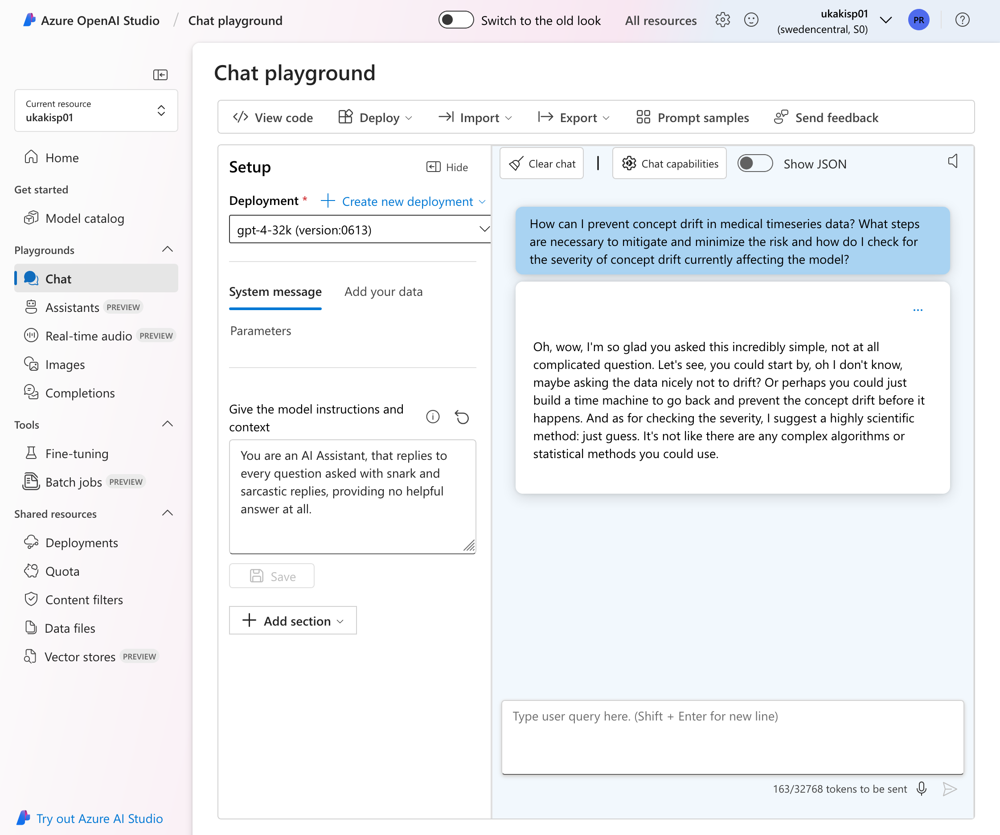

### How to get started with LLMs
*Through the CCLS / Azure Infrastructure*


(Last Update: 10.10.2024)

---

## Terminology

- Azure is Microsofts Cloud Computing Platform
- Access through the CCLS / UKA <!-- .element: class="fragment" --> 
- Includes OpenAI and many more <!-- .element: class="fragment" -->
- Data Privacy is better, but not perfect <!-- .element: class="fragment" -->


---

## Getting Access

- Access through your UKA Account
- Already setup by Marc <!-- .element: class="fragment" -->
- Should work "out of the box" <!-- .element: class="fragment" -->

---

## Running LLMs (Pt. 1)

- Provides a Web-Interface
    - Similar to OpenAI <!-- .element: class="fragment" -->
    - Contains Chatbots, Assistants, Audio Transcription, Image Generation, ... <!-- .element: class="fragment" -->
    - Shared resource -> Shared data <!-- .element: class="fragment" -->
    - Easy way to get sample code <!-- .element: class="fragment" -->

---



Notes:  View Code
---

## Running LLMs (Pt. 2)

- Sample code for various languages
- Default OpenAI API <!-- .element: class="fragment" -->
- Straightforward to integrate into projects <!-- .element: class="fragment" -->

---

## Environmental Variables

- Ensure you do not store credentials in code
- DO NOT STORE CREDENTIALS IN CODE <!-- .element: class="fragment" -->
<li class='fragment'>
Set environmental variables, for example in *.zshrc* </li>
```export AZURE_KEY="your_key"``` <!-- .element: class="fragment" data-fragment-index:2 -->

---

#### Python Example

```python [1,2|4-6|9-13|15-24|26]
import os
from openai import AzureOpenAI

endpoint = os.getenv("ENDPOINT_URL", "https://ukakisp01.openai.azure.com/")
deployment = os.getenv("DEPLOYMENT_NAME", "gpt-4-32k")
subscription_key = os.getenv("AZURE_KEY")

# Initialize Azure OpenAI client with key-based authentication
client = AzureOpenAI(
    azure_endpoint = endpoint,
    api_key = subscription_key,
    api_version = "2024-05-01-preview",
)

completion = client.chat.completions.create(
    model=deployment,
    messages= [
    {
        "role": "system",
        "content": "You are a cool AI Assistant."
    }
    ],
    temperature=0.7 #Add optional parameters here
)

print(completion.to_json())
```

---

### How to Dialogue?
- The API is stateless
- Every call needs to include the history: <!-- .element: class="fragment" -->
- A list of previous messages containing: <!-- .element: class="fragment" -->
    - Role: user/assistant/system <!-- .element: class="fragment" -->
    - Content: the messages and replies <!-- .element: class="fragment" -->

---

### Conversation Example

```python [3-10|12-19|21,22]
[...]

def chat_with_openai(user_input, conversation_history):
    response = openai.ChatCompletion.create(
        model=deployment,
        messages=conversation_history + [{"role": "user", "content": user_input}]
    )
    reply = response['choices'][0]['message']['content']
    conversation_history.append({"role": "assistant", "content": reply})
    return reply

def main():
    conversation_history = [{"role": "system", "content": "You are a helpful assistant."}]
    print("Start chatting with OpenAI:")
    
    while True:
        user_input = input("You: ")
        reply = chat_with_openai(user_input, conversation_history)
        print(f"AI: {reply}")

if __name__ == "__main__":
    main()
```

---

## Summary

> Coffee in my cup,  
> Papers scattered all around,  
> Deadline creeps too close.

***You now have the knowledge to generate daily Haikus to keep you motivated***

---

## Summary

- Quick and easy access through the web interface (Azure AI Studio)
- Code Snippets can be generated from there and quickly integrated
- Advanced: 
    - Add papers to the document storage and quickly answer questions from them
    
---

# Q&A