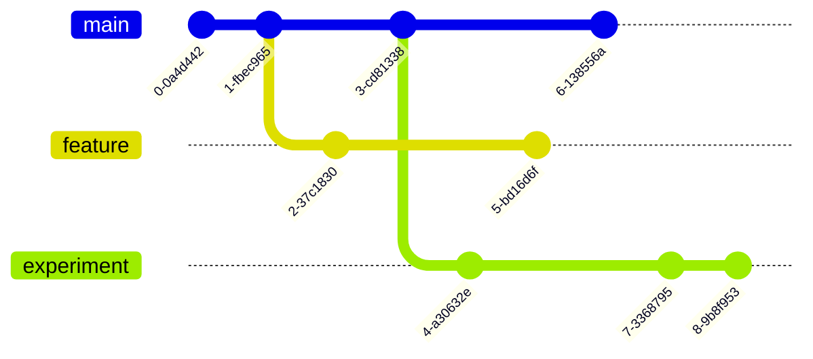

---
# You can also start simply with 'default'
theme: seriph
# random image from a curated Unsplash collection by Anthony
# like them? see https://unsplash.com/collections/94734566/slidev
background: "title.png"
# some information about your slides (markdown enabled)
title: Version Control for Researchers
# apply unocss classes to the current slide
class: text-center
# https://sli.dev/features/drawing
drawings:
  persist: false
# slide transition: https://sli.dev/guide/animations.html#slide-transitions
transition: slide-left
# enable MDC Syntax: https://sli.dev/features/mdc
mdc: true
---

# Version Control for Researchers

Richard Polzin (13.02.2025)

<div class="abs-br m-6 text-xl">
  <a href="https://richardpolzin.com" target="_blank" class="slidev-icon-btn">
    <carbon:user-filled />
  </a>
</div>

<!--
The last comment block of each slide will be treated as slide notes. It will be visible and editable in Presenter Mode along with the slide. [Read more in the docs](https://sli.dev/guide/syntax.html#notes)
-->

---
layout: two-cols
---


::right::

<Toc minDepth="1" maxDepth="1" />

---
layout: two-cols
---

# ✨Version Control✨ {.inline-block.view-transition-title}

<div v-click><h2>What?</h2></div>

<v-clicks>
  <ul>
    <li>A system for managing changes to files over time</li>
    <li>Allows simultaneous work on the same project </li>
    <li>A history of changes and the ability to revert</li>
    <li>Logically separate features 🤯</li>
  </ul>
</v-clicks>

<br>

<div v-click><h2>Why?</h2></div>

<v-clicks>
<ul>
  <li>Makes collaboration easier 🥇</li>
  <li>Who deleted my files? Where is my main.py??</li>
  <li>Tracking changes and ensuring reproducibility</li>
  <li>Avoiding "final_version_v3_revised_FINAL.py" 😵‍💫</li>
  <li>Backup and restoring previous versions</li>
</ul>
</v-clicks>

::right::

<div v-click><h2>How?</h2></div>
<div v-click><h3>Git of course!</h3></div>

<v-clicks>
  <ul>
    <li>A distributed version control system (VCS)</li>
    <li>Tracks changes in code and text files</li>
    <li>Enables collaboration across different versions</li>
    <li>Supports parallel development</li>
    <li>Provides a detailed history of changes for accountability</li>
  </ul>
</v-clicks>

<br>

<div
  v-motion
  :initial="{ x: 500 }"
  :click-13="{ x: 40, y: 30 }"
  :leave="{ y: 30, x: 0 }"
>

</div>

---

# Git Workshop

## Key Concepts

<style>
strong {
  color: goldenrod;
}
</style>

<ul>
  <li v-click="1"><strong>Repository (Repo):</strong> A directory containing all project files and history</li>
  <li v-click="3"><strong>Commit:</strong> A snapshot of changes</li>
  <li v-click="4"><strong>Branch:</strong> Parallel versions of the repository</li>
  <li v-click="5"><strong>Merge:</strong> Combining different branches</li>
  <li v-click="6"><strong>Remote:</strong> A repository hosted elsewhere (e.g., GitHub, GitLab)</li>
</ul>

<div
  v-motion
  v-click.hide=3
  :initial="{ x: 1000 }"
  :click-1="{ x: 40, y: -100 }"
  :click-3="{ x: -1000, y: -100 }"
  :leave="{ y: 30, x: 0 }"
>

</div>
<div v-click.hide="3">
<arrow  v-click="2" x1="300" y1="300" x2="170" y2="320" color="#953" width="3" arrowSize="5" />
</div>
<div
  v-motion
  v-click.hide=4
  :initial="{ x: 1000 }"
  :click-3="{ x: 40, y: -350 }"
  :click-4="{ x: -1000, y: -350 }"
  :leave="{ y: 30, x: 0 }"
>
```bash
commit 0127a4e6b03cec81c38391dc643f50fdfee75f4b (HEAD -> main)
Author: Richard Polzin <richard.polzin@posteo.de>
Date:   Mon Feb 3 13:37:57 2025 +0100

    Initial commit
```
</div>
<div
  v-motion
  v-click.hide=4
  :initial="{ x: 1000 }"
  :click-3="{ x: 350, y: -400 }"
  :click-4="{ x: -1000, y: -400 }"
  :leave="{ x: -1000, y: -400 }"
>

</div>

<div
  v-motion
  v-click.hide=6
  :initial="{ x: 1000 }"
  :click-4="{ x: 150, y: -650 }"
  :click-5="{ x: -1000, y: -650 }"
  :leave="{ x: -1000 }"
>

</div>
<div
  v-motion
  v-click.hide=6
  :initial="{ x: 1500 }"
  :click-5="{ x: 150, y: -850 }"
  :click-6="{ x: -1050, y: -850 }"
  :leave="{ x: -1050}"
>

</div>
<div
  v-motion
  :initial="{ x: 1000 }"
  :click-6="{ x: 0, y: -1000 }"
>
<div class="flex justify-center space-x-8">
    
    
</div>
</div>

---

<h4>Initial Setup</h4>

<div v-click=1>
```bash {*|1-4|6-8}
# Install Git
sudo apt install git  # Linux
brew install git  # macOS
choco install git.install  # Windows

# Configure Git
git config --global user.name "Your Name"
git config --global user.email "your.email@example.com"
```
</div>
<div v-click>

</div>

<v-clicks>
<ul>
  <li><strong style="color: goldenrod;">Initialize Repository:</strong> Start a new repository with <code>git init</code>.</li>
  <li><strong style="color: goldenrod;">Make Changes:</strong> Modify files in your working directory.</li>
  <li><strong style="color: goldenrod;">Commit Changes:</strong> Save snapshots of your changes with <code>git commit</code>.</li>
  <li><strong style="color: goldenrod;">Push to Remote:</strong> Upload your commits to a remote repository with <code>git push</code>.</li>
  <li><strong style="color: goldenrod;">Pull Updates:</strong> Fetch and integrate changes from the remote repository with <code>git pull</code>.</li>
</ul>
</v-clicks>

---
layout: center
---

# Example

```bash {1-3|4-6|7|7-10|11-12|11-14|15-16|17-18|17-25|26-27|26-35|36-37|37-42}{maxHeight:'300px', lines:true}
$ # Initialize a new Git repository
$ git init my_project # Create the directory and a .git folder in it
$ cd my_project
$ # Create a file and commit it
$ echo "# My Research Project" > README.md
$ git add README.md
$ git commit -m "Initial commit"
> Initial commit
> 1 file changed, 1 insertion(+)
> create mode 100644 README.md
$ # Check the status
$ git status
> On branch main
> nothing to commit, working tree clean
$ # Change a file
$ echo "\nthis is my cool description." >> README.md
$ # Check the status
$ git status
> On branch master
> Changes not staged for commit:
>   (use "git add <file>..." to update what will be committed)
>   (use "git restore <file>..." to discard changes in working directory)
> 	modified:   README.md
> 
> no changes added to commit (use "git add" and/or "git commit -a")
$ # Check the differences
$ git diff
> diff --git a/README.md b/README.md
> index 22c86a3..0628ec3 100644
> --- a/README.md
> +++ b/README.md
> @@ -1 +1,3 @@
>  # My Research Project
> +
> +this is my cool description.
$ # Check the commit history
$ git log
> commit 0127a4e6b03cec81c38391dc643f50fdfee75f4b (HEAD -> main)
> Author: Richard Polzin <richard.polzin@posteo.de>
> Date:   Mon Feb 3 13:37:57 2025 +0100
>
>    Initial commit
```

---
layout: center
---
# Recap

<v-clicks>
<ul>
  <li><strong style="color: goldenrod;">Version Control:</strong> Manage changes to files over time, enable collaboration and track history.</li>
  <li><strong style="color: goldenrod;">Git:</strong> The (coolest 😉) software to do version control with.</li>
  <li><strong style="color: goldenrod;">Key Concepts:</strong> Repository, Commit, Branch, Merge, Remote.</li>
  <li><strong style="color: goldenrod;">Basic Commands:</strong> <code>git init</code>, <code>git add</code>, <code>git commit</code>, <code>git status</code>, <code>git log</code>, <code>git diff</code>.</li>
</ul>
</v-clicks>

---
layout: center
---

# Branching and Merging


---

# Branching and Merging
<br>

<v-clicks>
  <ul>
    <li><strong style="color: goldenrod;">Isolation:</strong> Work on different features or fixes separately from the main codebase.</li>
    <li><strong style="color: goldenrod;">Parallel Development:</strong> Enable team members to work on separate features simultaneously.</li>
    <li><strong style="color: goldenrod;">History Tracking:</strong> Maintain individual commit histories for easy tracking and reversion.</li>
    <li><strong style="color: goldenrod;">Merging:</strong> Combine changes from different branches back into the main codebase.</li>
    <li><strong style="color: goldenrod;">Experimentation:</strong> Safely test new ideas without affecting the stable codebase.</li>
  </ul>
</v-clicks>

<br>

<div v-click="6">
```bash{1-2|1-2|1-2|4-6|4-6}
# Create and switch to a new branch
git checkout -b new_feature

# Merge changes back to main branch
git checkout main
git merge new_feature
```
</div>

<div v-click="7">
<arrow  x1="500" y1="500" x2="570" y2="420" color="#953" width="3" arrowSize="5" />
</div>

<div v-click="9">
<arrow  x1="900" y1="400" x2="800" y2="350" color="#953" width="3" arrowSize="5" />
</div>

<div
  v-motion
  :initial="{ x:  1000,  y: -120 }"
  :click-6="{ x: 400, y: -120 }"
  :leave="{ x:400, y:-120 }"
>

</div>


---
layout: two-cols
---

## Collaborating with Remotes

<v-clicks>
<ul>
  <li><strong style="color: goldenrod;">Remote Repository:</strong> A version of your project hosted on the internet.</li>
  <li><strong style="color: goldenrod;">Push/Pull:</strong> Upload/Download changes to and from remote.</li>
  <li><strong style="color: goldenrod;">Origin:</strong> The name of the remote repository.</li>
  <li><strong style="color: goldenrod;">Clone:</strong> Create a local copy of a remote repository.</li>
</ul>
</v-clicks>

<div
  v-motion
  :initial="{ x:  0,  y: 400 }"
  :click-1="{ x: 0, y: 0 }"
  :leave="{ x:0, y: 0 }"
>
```bash {1-2|1-2|4-8|4-8|10-11}{at:1}
# Add a remote repository
git remote add origin https://github.com/user/repo.git

# Push local changes
git push -u origin main

# Pull updates from remote
git pull origin main

# Alternatively clone a remote repository
git clone https://github.com/user/repo.git
```
</div>

::right::

<div
  v-motion
  :initial="{ x:  600,  y: 0 }"
  :click-1="{ x: 0, y: 0 }"
  :leave="{ x:0, y: 0 }"
>

</div>

<div
  v-motion
  :initial="{ x:  600,  y: -60 }"
  :click-4="{ x: 20, y: -60 }"
  :leave="{ x: 20, y: -60 }"
>
```bash
$ git clone git@git.rwth-aache...
> Cloning into 'virtual_patient_radiology'...
> remote: Enumerating objects: 117, done.
> remote: Counting objects: 100% (83/83), done.
> remote: Compressing objects: 100% (83/83), done.
> remote: Total 117 (delta 38), reused 0 (delta 0)
> Receiving objects: 100% (117/117), 45.03 KiB | 5.00 Mbs
> Resolving deltas: 100% (50/50), done.
```
</div>

---
layout: center
---

# Best Practices (for Researchers)

<v-clicks>
<ul>
  <li>📝 Use meaningful commit messages</li>
  <li>📁 Keep repositories organized</li>
  <li>🚫 Use <code>.gitignore</code> for large files and temporary files</li>
  <li>🔄 Regularly push to a remote repository</li>
  <li>🌿 Use branches for experimental changes</li>
</ul>
</v-clicks>

---
layout: center
---

## GitHub, GitLab, and Alternatives

- **GitHub:** Popular for open-source projects, big publicity/community
- **GitLab:** Itself Open-Source, available from RWTH-Aachen for Education only
- **Gitlab-CE:** Same as above, but more free license, less features

---
layout: center
---

## Advanced Topics (t.b.d.)

- Using Git with Jupyter Notebooks
- Git Large File Storage (LFS) for datasets
- Continuous Integration (CI) for automating workflows
- Working with submodules for modular projects

---
layout: two-cols
---

# Summary

<br><br><br>
- Version Control helps manage research projects efficiently
- Enables collaboration and reproducibility
- Learning basic Git commands is a valuable skill
- Use hosted platforms for better sharing and tracking
- Start early, commit often, write good commit messages

::right::


