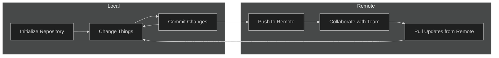
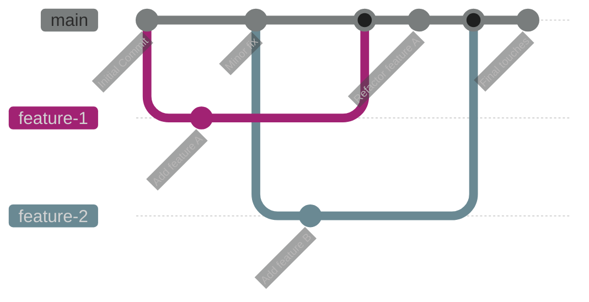
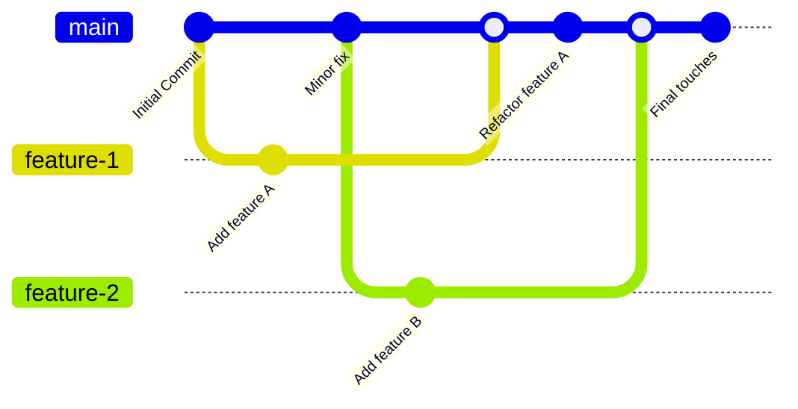

## Version Control for Researchers
Richard Polzin  
Institute for Computational Biomedicine, RWTH Aachen University  
*(Last Update 10.02.2025)*

---

<Toc minDepth="1" maxDepth="1" />

---

# ✨Version Control✨

---

## What?

- A system for managing changes to files over time <!-- .element: class="fragment" -->
- Online / Offline / Remote synchronization of these changes <!-- .element: class="fragment" -->
- Allows multiple people to work on the same project simultaneously <!-- .element: class="fragment" -->
- Provides a history of changes and the ability to revert to previous versions <!-- .element: class="fragment" -->
- Facilitates collaboration and coordination among team members <!-- .element: class="fragment" -->

---

## Why?

- Makes collaboration tremendously easier <!-- .element: class="fragment" -->
    - Who deleted my files? Where is my main.py?? <!-- .element: class="fragment" -->
- Tracking changes and ensuring reproducibility <!-- .element: class="fragment" -->
- Avoiding "final_version_v3_revised_FINAL.py" <!-- .element: class="fragment" -->
- Backup and restoring previous versions <!-- .element: class="fragment" -->
    - We could need that one piece of code we wrote months ago!<!-- .element: class="fragment" -->

---

## How?
#### Git of course! <!-- .element: class="fragment" -->

- A distributed version control system (VCS) <!-- .element: class="fragment" -->
- Tracks changes in code and text files <!-- .element: class="fragment" -->
- Enables collaboration across different versions <!-- .element: class="fragment" -->
- Supports parallel development <!-- .element: class="fragment" -->
- Provides a detailed history of changes for accountability <!-- .element: class="fragment" -->

---

# Git Workshop

---

## Key Concepts

- **Repository (Repo):** A directory containing all project files and history
- **Commit:** A snapshot of changes 
- **Branch:** Parallel versions of the repository 
- **Merge:** Combining different branches  
- **Remote:** A repository hosted elsewhere (e.g., GitHub, GitLab) 

---

## Setting Up Git

```bash
# Install Git
sudo apt install git  # Linux
brew install git  # macOS
choco install git.install  # Windows

# Configure Git
git config --global user.name "Your Name"
git config --global user.email "your.email@example.com"
```

---

## Git Repository Lifecycle




- **Initialize Repository:** Start a new repository with `git init`.
- **Make Changes:** Modify files in your working directory.
- **Commit Changes:** Save snapshots of your changes with `git commit`.
- **Push to Remote:** Upload your commits to a remote repository with `git push`.
- **Pull Updates:** Fetch and integrate changes from the remote repository with `git pull`.


---
<!-- .slide: data-auto-animate -->
## Creating a Repository<!-- .element: data-id="code-animation"-->

Let us create a repository for `my_project`
```bash
# Initialize a new Git repository
git init my_project # Create the directory and a .git folder in it
cd my_project
```

---

<!-- .slide: data-auto-animate -->
## Creating a Repository<!-- .element: data-id="code-animation"-->
Let us create a repository for `my_project`
```bash
# Initialize a new Git repository
git init my_project # Create the directory and a .git folder in it
cd my_project
```

Now add a `README.md` file to it and commit it

```bash
# Create a file and commit it
echo "# My Research Project" > README.md
git add README.md
git commit -m "Initial commit"
```

---

<!-- .slide: data-auto-animate -->
## Creating a Repository<!-- .element: data-id="code-animation"-->
Let us create a repository for `my_project`
```bash
# Initialize a new Git repository
git init my_project # Create the directory and a .git folder in it
cd my_project
```

Now add a `README.md` file to it and commit it

```bash
# Create a file and commit it
echo "# My Research Project" > README.md
git add README.md
git commit -m "Initial commit"
```

The file `README.md` is now created and has been added to the git repository

```bash
 > Initial commit
 > 1 file changed, 1 insertion(+)
 > create mode 100644 README.md
```

---

## Interacting with Git: Status

```bash
# View repository status
git status
```

Example output:
```bash
On branch main
Your branch is up to date with 'origin/main'.

Untracked files:
    (use "git add <file>..." to include in what will be committed)
        newfile.txt

nothing added to commit but untracked files present (use "git add" to track)
```

---

## Interacting with Git: Log

```bash
# View commit history
git log
```

Example output:
```bash
commit 0127a4e6b03cec81c38391dc643f50fdfee75f4b (HEAD -> main)
Author: Richard Polzin <richard.polzin@posteo.de>
Date:   Mon Feb 3 13:37:57 2025 +0100

    Initial commit
```

---

## Interacting with Git: Diff

```bash
# Compare changes
git diff
```

Example output:
```diff
diff --git a/README.md b/README.md
index 22c86a3..0628ec3 100644
--- a/README.md
+++ b/README.md
@@ -1 +1,3 @@
 # My Research Project
+
+this is my cool description.
```

---

## Recap

- **Version Control:** Manage changes to files over time, enable collaboration and track history.
- **Git:** The (coolest 😉)  software to do version control with.
- **Key Concepts:** Repository, Commit, (Branch, Merge, Remote.)
- **Basic Commands:** `git init`, `git add`, `git commit`, `git status`, `git log`, `git diff`.

*Next up:* Branching and Merging, Pushing and Pulling
---



---


## Branching and Merging

```bash
# Create and switch to a new branch
git checkout -b new_feature

# Merge changes back to main branch
git checkout main
git merge new_feature
```

---

## Git History Visualization



---

## Collaborating with Remotes

```bash
# Add a remote repository
git remote add origin https://github.com/username/repository.git

# Push local changes
git push -u origin main

# Pull updates from remote
git pull origin main
```

---

## Best Practices for Researchers

- Use meaningful commit messages
- Keep repositories organized
- Use `.gitignore` for large files and temporary files
- Regularly push to a remote repository
- Use branches for experimental changes
- Automate documentation and backups

---

## GitHub, GitLab, and Alternatives

- **GitHub:** Popular for open-source and academic projects
- **GitLab:** Self-hosted options and CI/CD integration
- **Bitbucket:** Supports Mercurial and Git
- **Codeberg:** Privacy-friendly alternative

---

## Advanced Topics

- Using Git with Jupyter Notebooks
- Git Large File Storage (LFS) for datasets
- Continuous Integration (CI) for automating workflows
- Working with submodules for modular projects

---

## Summary

- Git helps manage research projects efficiently
- Enables collaboration and reproducibility
- Learning basic Git commands is a valuable skill
- Use hosted platforms for better sharing and tracking

---

## Q&A

(Feel free to ask questions!)