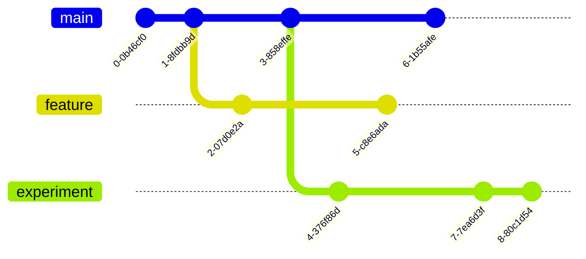
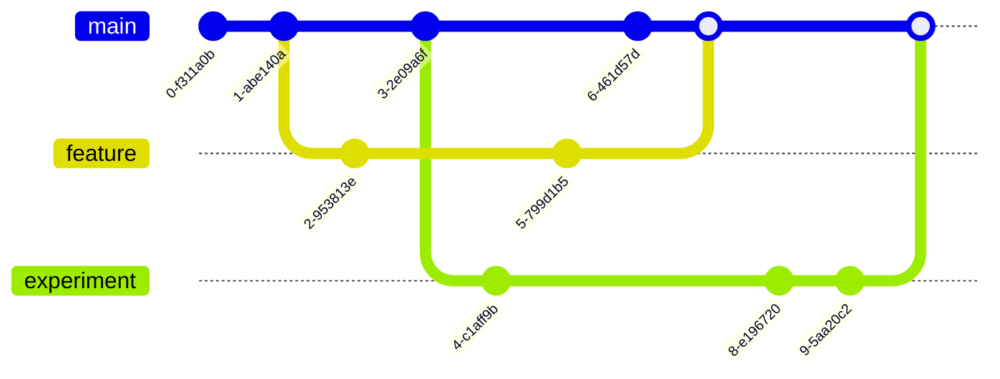
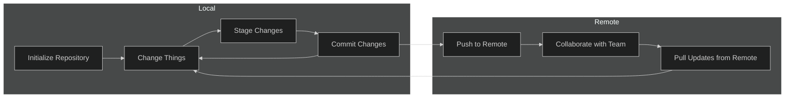
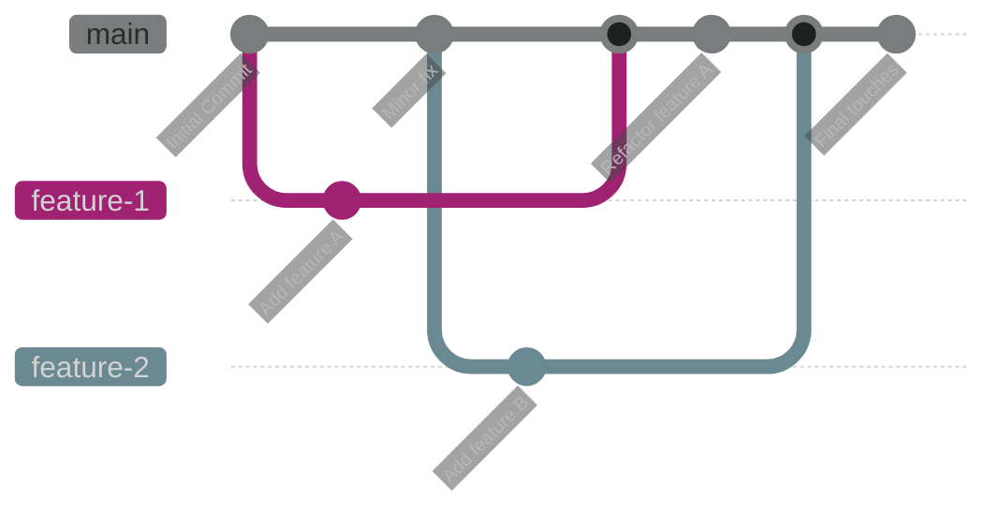
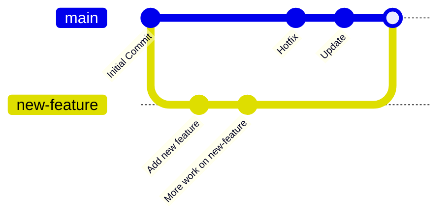

---
# You can also start simply with 'default'
theme: seriph
colorSchema: dark
# random image from a curated Unsplash collection by Anthony
# like them? see https://unsplash.com/collections/94734566/slidev
background: "title.png"
# some information about your slides (markdown enabled)
title: Version Control for Researchers
# apply unocss classes to the current slide
class: text-center
# https://sli.dev/features/drawing
drawings:
  persist: false
# slide transition: https://sli.dev/guide/animations.html#slide-transitions
transition: slide-left
# enable MDC Syntax: https://sli.dev/features/mdc
mdc: true
---

# Version Control for Researchers

Richard Polzin (19.08.2026)

<div class="abs-br m-6 text-xl">
  <a href="https://richardpolzin.com" target="_blank" class="slidev-icon-btn">
    <carbon:user-filled />
  </a>
</div>

<!--
The last comment block of each slide will be treated as slide notes. It will be visible and editable in Presenter Mode along with the slide. [Read more in the docs](https://sli.dev/guide/syntax.html#notes)
-->

---
layout: two-cols
---

# Table of Contents

<br>

Today we'll cover the fundamentals of version control and Git — from your first commit to collaborating with others.

::right::

<Toc minDepth="1" maxDepth="1" />

---
layout: two-cols
---

# ✨Version Control✨ {.inline-block.view-transition-title}

<div v-click><h2>What?</h2></div>

<v-clicks>
  <ul>
    <li>A system for managing changes to files over time</li>
    <li>Allows simultaneous work on the same project </li>
    <li>A history of changes and the ability to revert</li>
    <li>Logically separate features 🤯</li>
  </ul>
</v-clicks>

<br>

<div v-click><h2>Why?</h2></div>

<v-clicks>
<ul>
  <li>Makes collaboration easier 🥇</li>
  <li>Who deleted my files? Where is my main.py??</li>
  <li>Tracking changes and ensuring reproducibility</li>
  <li>Avoiding "final_version_v3_revised_FINAL.py" 😵‍💫</li>
  <li>Backup and restoring previous versions</li>
</ul>
</v-clicks>

::right::

<div v-click><h2>How?</h2></div>
<div v-click><h3>Git of course!</h3></div>

<v-clicks>
  <ul>
    <li>A distributed version control system (VCS)</li>
    <li>Tracks changes in code and text files</li>
    <li>Enables collaboration across different versions</li>
    <li>Supports parallel development</li>
    <li>Provides a detailed history of changes for accountability</li>
  </ul>
</v-clicks>

<br>

<div
  v-motion
  :initial="{ x: 500 }"
  :click-13="{ x: 40, y: 30 }"
  :leave="{ y: 30, x: 0 }"
>

</div>

---

# But I Work Alone...

<v-clicks>
<ul>
  <li>🕰️ <strong style="color: goldenrod;">Time travel for your own work</strong> — ever broken something and not known what changed? <code>git diff</code> and <code>git log</code> answer that instantly</li>
  <li>🧪 <strong style="color: goldenrod;">Safe experimentation</strong> — try a completely different approach on a branch; if it fails, delete it and you're back to where you started</li>
  <li>🏷️ <strong style="color: goldenrod;">Reproducibility</strong> — tag the exact code state used for a paper submission; re-run it a year later and get the same results</li>
  <li>💾 <strong style="color: goldenrod;">Free offsite backup</strong> — push to GitHub/GitLab and your work survives a stolen or dead laptop</li>
  <li>🤝 <strong style="color: goldenrod;">Future-you is a collaborator too</strong> — good commit messages are messages to yourself six months from now</li>
</ul>
</v-clicks>

---

# Git Workshop

## Key Concepts

<style>
strong {
  color: goldenrod;
}
</style>

<ul>
  <li v-click="1"><strong>Repository (Repo):</strong> A directory containing all project files and history</li>
  <li v-click="3"><strong>Commit:</strong> A snapshot of changes</li>
  <li v-click="4"><strong>Branch:</strong> Parallel versions of the repository</li>
  <li v-click="5"><strong>Merge:</strong> Combining different branches</li>
  <li v-click="6"><strong>Remote:</strong> A repository hosted elsewhere (e.g., GitHub, GitLab)</li>
</ul>

<div
  v-motion
  v-click.hide=3
  :initial="{ x: 1000 }"
  :click-1="{ x: 40, y: -100 }"
  :click-3="{ x: -1000, y: -100 }"
  :leave="{ y: 30, x: 0 }"
>

</div>
<div v-click.hide="3">
<arrow  v-click="2" x1="300" y1="300" x2="170" y2="320" color="#953" width="3" arrowSize="5" />
</div>
<div
  v-motion
  v-click.hide=4
  :initial="{ x: 1000 }"
  :click-3="{ x: 40, y: -350 }"
  :click-4="{ x: -1000, y: -350 }"
  :leave="{ y: 30, x: 0 }"
>
```bash
commit 0127a4e6b03cec81c38391dc643f50fdfee75f4b (HEAD -> main)
Author: Your Name <you@example.com>
Date:   Mon Aug 17 13:37:57 2026 +0100

    Initial commit
```
</div>
<div
  v-motion
  v-click.hide=4
  :initial="{ x: 1000 }"
  :click-3="{ x: 350, y: -400 }"
  :click-4="{ x: -1000, y: -400 }"
  :leave="{ x: -1000, y: -400 }"
>

</div>

<div
  v-motion
  v-click.hide=6
  :initial="{ x: 1000 }"
  :click-4="{ x: 150, y: -650 }"
  :click-5="{ x: -1000, y: -650 }"
  :leave="{ x: -1000 }"
>

</div>
<div
  v-motion
  v-click.hide=6
  :initial="{ x: 1500 }"
  :click-5="{ x: 150, y: -850 }"
  :click-6="{ x: -1050, y: -850 }"
  :leave="{ x: -1050}"
>

</div>
<div
  v-motion
  :initial="{ x: 1000 }"
  :click-6="{ x: 0, y: -1000 }"
>
<div class="flex justify-center space-x-8">
    
    
</div>
</div>

---

# Initial Setup

<div v-click=1>
```bash {*|1-4|6-8}
# Install Git
sudo apt install git  # Linux
brew install git  # macOS
choco install git.install  # Windows

# Configure Git
git config --global user.name "Your Name"
git config --global user.email "your.email@example.com"
```
</div>
<div v-click>

</div>

<div v-click>

> Not a CLI person? GitHub Desktop or your editor's built-in Git panel (e.g. VS Code) cover the same workflow with buttons instead of commands — this workshop uses the command line because it's the same everywhere.

</div>

---

# The Basic Workflow

<v-clicks>
<ul>
  <li><strong style="color: goldenrod;">Initialize Repository:</strong> Start a new repository with <code>git init</code>.</li>
  <li><strong style="color: goldenrod;">Make Changes:</strong> Modify files in your working directory.</li>
  <li><strong style="color: goldenrod;">Stage Changes:</strong> Select which changes to include with <code>git add</code>. Git requires an explicit staging step — only staged files go into the next commit.</li>
  <li><strong style="color: goldenrod;">Commit Changes:</strong> Save a snapshot of staged changes with <code>git commit</code>.</li>
  <li><strong style="color: goldenrod;">Push to Remote:</strong> Upload your commits to a remote repository with <code>git push</code>.</li>
  <li><strong style="color: goldenrod;">Pull Updates:</strong> Fetch and integrate changes from the remote repository with <code>git pull</code>.</li>
</ul>
</v-clicks>

---
layout: center
---

# Example

```bash {1-3|4-6|7|7-10|11-12|11-14|15-16|17-18|17-25|26-27|26-35|36-37|37-42}{maxHeight:'300px', lines:true}
$ # Initialize a new Git repository
$ git init my_project # Create the directory and a .git folder in it
$ cd my_project
$ # Create a file and commit it
$ echo "# My Research Project" > README.md
$ git add README.md
$ git commit -m "Initial commit"
> Initial commit
> 1 file changed, 1 insertion(+)
> create mode 100644 README.md
$ # Check the status
$ git status
> On branch main
> nothing to commit, working tree clean
$ # Change a file
$ printf "\nthis is my cool description.\n" >> README.md
$ # Check the status
$ git status
> On branch main
> Changes not staged for commit:
>   (use "git add <file>..." to update what will be committed)
>   (use "git restore <file>..." to discard changes in working directory)
> 	modified:   README.md
> 
> no changes added to commit (use "git add" and/or "git commit -a")
$ # Check the differences
$ git diff
> diff --git a/README.md b/README.md
> index 22c86a3..0628ec3 100644
> --- a/README.md
> +++ b/README.md
> @@ -1 +1,3 @@
>  # My Research Project
> +
> +this is my cool description.
$ # Check the commit history
$ git log
> commit 0127a4e6b03cec81c38391dc643f50fdfee75f4b (HEAD -> main)
> Author: Your Name <you@example.com>
> Date:   Mon Aug 17 13:37:57 2026 +0100
>
>    Initial commit
```

---
layout: center
---
# Recap

<v-clicks>
<ul>
  <li><strong style="color: goldenrod;">Version Control:</strong> Manage changes to files over time, enable collaboration and track history.</li>
  <li><strong style="color: goldenrod;">Git:</strong> The (coolest 😉) software to do version control with.</li>
  <li><strong style="color: goldenrod;">Key Concepts:</strong> Repository, Commit, Branch, Merge, Remote.</li>
  <li><strong style="color: goldenrod;">Basic Commands:</strong> <code>git init</code>, <code>git add</code> (stage), <code>git commit</code> (snapshot), <code>git status</code>, <code>git log</code>, <code>git diff</code>.</li>
</ul>
</v-clicks>

---
layout: center
---

# Branching and Merging: The Idea



---

# Branching and Merging: In Practice
<br>

<v-clicks>
  <ul>
    <li><strong style="color: goldenrod;">Isolation:</strong> Work on different features or fixes separately from the main codebase.</li>
    <li><strong style="color: goldenrod;">Parallel Development:</strong> Enable team members to work on separate features simultaneously.</li>
    <li><strong style="color: goldenrod;">History Tracking:</strong> Maintain individual commit histories for easy tracking and reversion.</li>
    <li><strong style="color: goldenrod;">Merging:</strong> Combine changes from different branches back into the main codebase.</li>
    <li><strong style="color: goldenrod;">Experimentation:</strong> Safely test new ideas without affecting the stable codebase.</li>
  </ul>
</v-clicks>

<br>

<div v-click="6">
```bash{1-2|1-2|1-2|4-6|4-6}
# Create and switch to a new branch (modern syntax)
git switch -c new_feature  # older: git checkout -b new_feature

# Merge changes back to main branch
git switch main
git merge new_feature
```
</div>

<div v-click="7">
<arrow  x1="500" y1="500" x2="570" y2="420" color="#953" width="3" arrowSize="5" />
</div>

<div v-click="9">
<arrow  x1="900" y1="400" x2="800" y2="350" color="#953" width="3" arrowSize="5" />
</div>

<div
  v-motion
  :initial="{ x:  1000,  y: -120 }"
  :click-6="{ x: 400, y: -120 }"
  :leave="{ x:400, y:-120 }"
>

</div>


---

# Quick Context Switch: git stash

Need to switch branches but you're mid-change and not ready to commit? Don't panic-commit — stash it.

<v-clicks>
<ul>
  <li><code>git stash</code> — shelves your uncommitted changes, gives you a clean working directory</li>
  <li><code>git switch other-branch</code> — do whatever you needed to do</li>
  <li><code>git switch -</code> back, then <code>git stash pop</code> — restores your changes and removes them from the stash</li>
</ul>
</v-clicks>

<div v-click>

```bash
$ git stash
> Saved working directory and index state WIP on main: a1b2c3d Add feature
$ git switch main
$ git switch -
$ git stash pop
> On branch new_feature
> Changes not staged for commit: ...
```

</div>

<div v-click>

> <code>git stash list</code> shows all shelved stashes — you can stash more than once.

</div>

---
layout: center
---

# Merge Conflicts

When two branches change the same lines, Git can't merge automatically.

<div v-click>

```bash
$ git merge new_feature
> CONFLICT (content): Merge conflict in analysis.py
> Automatic merge failed; fix conflicts and then commit the result.
```

</div>

<div v-click>

Git marks the conflicting section — edit the file to resolve it:

```diff
- threshold = 0.5   # your version (main)
+ threshold = 0.8   # incoming version (new_feature)
```

</div>

<v-clicks>
<ul>
  <li>Edit the file to keep what you want and remove the markers</li>
  <li><code>git add analysis.py</code> — mark it resolved</li>
  <li><code>git commit</code> — complete the merge</li>
  <li><code>git status</code> shows which files still have conflicts</li>
</ul>
</v-clicks>

---
layout: two-cols
---

## Collaborating with Remotes

<v-clicks>
<ul>
  <li><strong style="color: goldenrod;">Remote Repository:</strong> A version of your project hosted on the internet.</li>
  <li><strong style="color: goldenrod;">Push/Pull:</strong> Upload/Download changes to and from remote.</li>
  <li><strong style="color: goldenrod;">Origin:</strong> The name of the remote repository.</li>
  <li><strong style="color: goldenrod;">Clone:</strong> Create a local copy of a remote repository.</li>
</ul>
</v-clicks>

<div
  v-motion
  :initial="{ x:  0,  y: 400 }"
  :click-1="{ x: 0, y: 0 }"
  :leave="{ x:0, y: 0 }"
>
```bash {1-2|1-2|4-8|4-8|10-11}{at:1}
# Add a remote repository
git remote add origin https://github.com/user/repo.git

# Push local changes
git push -u origin main

# Pull updates from remote
git pull origin main

# Alternatively clone a remote repository
git clone https://github.com/user/repo.git
```
</div>

::right::

<div
  v-motion
  :initial="{ x:  600,  y: 0 }"
  :click-1="{ x: 0, y: 0 }"
  :leave="{ x:0, y: 0 }"
>

</div>

<div
  v-motion
  :initial="{ x:  600,  y: -60 }"
  :click-4="{ x: 20, y: -60 }"
  :leave="{ x: 20, y: -60 }"
>
```bash
$ git clone git@git.rwth-aache...
> Cloning into 'virtual_patient_radiology'...
> remote: Enumerating objects: 117, done.
> remote: Counting objects: 100% (83/83), done.
> remote: Compressing objects: 100% (83/83), done.
> remote: Total 117 (delta 38), reused 0 (delta 0)
> Receiving objects: 100% (117/117), 45.03 KiB | 5.00 Mbs
> Resolving deltas: 100% (50/50), done.
```
</div>

---
layout: center
---

## GitHub, GitLab, and Alternatives

<div class="flex justify-center space-x-8 mb-4">
  
  
</div>

- **GitHub:** Most popular for open-source projects; large community and integrations
- **GitLab (RWTH):** Available for RWTH members at [git.rwth-aachen.de](https://git.rwth-aachen.de) — use your TIM credentials
- **GitLab-CE:** Self-hosted open-source version; fewer features but no vendor lock-in
- **Codeberg / Forgejo:** Community-run, fully open-source alternatives

---

# Best Practices (for Researchers)

<v-clicks>
<ul>
  <li>📝 <strong style="color: goldenrod;">Meaningful commit messages:</strong> "Fix threshold in model A" beats "fixed stuff"</li>
  <li>🌿 <strong style="color: goldenrod;">Branch per experiment:</strong> keep <code>main</code> clean; use branches for new ideas so you can always go back</li>
  <li>🏷️ <strong style="color: goldenrod;">Tag paper versions:</strong> <code>git tag v1.0-submission</code> so you can reproduce results from a specific submission</li>
  <li>🔄 <strong style="color: goldenrod;">Push regularly:</strong> remote = free backup; don't lose a week of work to a dead laptop</li>
  <li>📁 <strong style="color: goldenrod;">Version configs alongside code:</strong> commit your hyperparameter files and experiment configs, not just the scripts</li>
  <li>🚫 <strong style="color: goldenrod;">Use <code>.gitignore</code>:</strong> keep large data and temp files out of the repo</li>
</ul>
</v-clicks>

<div v-click>

```bash
# .gitignore for a typical Python research project
data/              # large datasets — use DVC or similar instead
*.h5               # model checkpoints
*.pkl
__pycache__/
.ipynb_checkpoints/
.env               # secrets / API keys — never commit these
```

</div>

---
layout: center
---

# From Tag to Citation: Zenodo

A <code>git tag</code> makes a submission reproducible on your machine — <a href="https://zenodo.org" target="_blank">Zenodo</a> makes it citable by anyone.

<v-clicks>
<ul>
  <li>Connect your GitHub repo to <a href="https://zenodo.org" target="_blank">zenodo.org</a> (free, one-time setup)</li>
  <li>Every new GitHub <strong style="color: goldenrod;">release</strong> is automatically archived and gets a permanent <strong style="color: goldenrod;">DOI</strong></li>
  <li>Cite the exact code version behind your results — in the paper, not just "code available on request"</li>
  <li>GitLab repos: archive manually via Zenodo's upload form</li>
</ul>
</v-clicks>

---

# Common Pitfalls

<v-clicks>
<ul>
  <li>🐘 <strong style="color: goldenrod;">Committing large files by accident</strong> — a 2 GB dataset in git history is permanent and painful to remove; set up <code>.gitignore</code> before the first commit</li>
  <li>😱 <strong style="color: goldenrod;">Detached HEAD</strong> — happens when you <code>git checkout</code> a commit hash directly; you're not on any branch, so commits get lost. Fix: <code>git switch main</code></li>
  <li>🔑 <strong style="color: goldenrod;">Committing secrets</strong> — API keys, passwords, <code>.env</code> files pushed to a public repo are compromised immediately; always <code>.gitignore</code> them</li>
  <li>💥 <strong style="color: goldenrod;">Force-pushing shared branches</strong> — <code>git push --force</code> rewrites history for everyone on the team; avoid on <code>main</code>, use <code>--force-with-lease</code> if you must</li>
  <li>📝 <strong style="color: goldenrod;">Vague commit messages</strong> — "fixed it" or "update" tells future-you nothing; a message like "Fix off-by-one in sliding window" is searchable and self-documenting</li>
  <li>🔀 <strong style="color: goldenrod;">Working directly on main</strong> — one bad commit blocks everyone; use branches even when working alone</li>
  <li>↩️ <strong style="color: goldenrod;">Line-ending chaos (CRLF vs LF)</strong> — Windows and Mac/Linux collaborators can turn every line of a file into a "change"; add a <code>.gitattributes</code> with <code>* text=auto</code> to normalize it repo-wide</li>
</ul>
</v-clicks>

---
layout: center
---

## Advanced Topics

- **Git LFS** — store large files (datasets, model weights) without bloating the repo: `git lfs track "*.h5"`
- **nbstripout / nbdime** — strip notebook outputs before committing so diffs stay readable
- **CI/CD** — automatically run tests or re-run analysis on every push (GitHub Actions, GitLab CI)
- **Submodules** — reference another repo inside yours; useful for shared libraries across projects
- **`git bisect`** — binary-search your commit history to find exactly which commit broke something
- **SSH keys** — stop typing your password on every push: `ssh-keygen` + add public key to GitHub/GitLab

---
layout: center
---

# Try It Yourself

```bash
# Create a repo and make your first commit
git init my_research && cd my_research
echo "# My Project" > README.md
git add README.md && git commit -m "Initial commit"

# Branch, change, merge
git switch -c add-description
echo "This project does X." >> README.md
git add README.md && git commit -m "Add project description"
git switch main && git merge add-description

# Explore the history
git log --oneline
```

<div class="mt-6 text-center text-green-400">

Push it to [git.rwth-aachen.de](https://git.rwth-aachen.de) or GitHub to get a free remote backup!

</div>

---
layout: two-cols
---

# Summary

<br><br><br>
- Version Control helps manage research projects efficiently
- Enables collaboration and reproducibility
- Learning basic Git commands is a valuable skill
- Use hosted platforms for better sharing and tracking
- Start early, commit often, write good commit messages

::right::


---
layout: center
class: text-center
---

# Questions?

<br>

Richard Polzin

[richardpolzin.com](https://richardpolzin.com) · [rpolzin@ukaachen.de](mailto:rpolzin@ukaachen.de) · [git.rwth-aachen.de](https://git.rwth-aachen.de)

