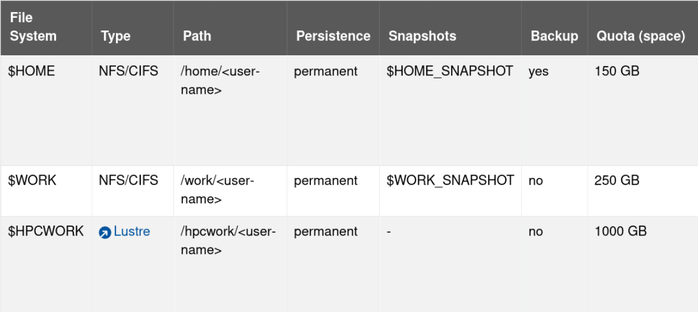

## Getting started with High Performance Computing in Research
_Richard Polzin <rpolzin@ukaachen.de\>_  
###### Last Updated: 14. Nov 2024  

---

### Table of Content

1. Introduction to HPC <!-- .element: class="fragment" data-fragment-index="1" -->
2. Working in the HPC Environment <!-- .element: class="fragment" data-fragment-index="2" -->
3. Job Management and Parallel Computing <!-- .element: class="fragment" data-fragment-index="3" -->
4. Best Practices, Support, and Next Steps <!-- .element: class="fragment" data-fragment-index="4" -->

---

# Introduction to HPC

<!--v-->

### Objectives
- Understand what HPC is
- Learn why HPC is essential for modern research
- Discover available HPC resources
- Walk through a project application process

<!--v-->
<!-- .slide: data-auto-animate -->
## What is HPC?<!-- .element: data-id="code-animation"-->

- **H**igh **P**erformance **C**omputing involves the use of supercomputers and parallel processing techniques to solve complex computational problems
- Combines computing resources for higher performance
- HPC Systems consist of clusters with interconnected nodes
- Enable processing larger datasets and complex simulations

<!--v-->
<!-- .slide: data-auto-animate -->
## What is HPC?<!-- .element: data-id="code-animation"-->


<!--v-->

## Why is HPC Essential?

- **Speed:** Reduces time to results
- **Capacity:** Handle large scale data and simulation
- **Complexity:** Solve problems to complex for standard computers

<!--v-->
<!-- .slide: data-auto-animate -->
## HPC Resources<!-- .element: data-id="code-animation"-->

- **State of the art** HPC facilities are available through the National High Performance Computing (NHR) network
- Including Compute Clusters, Large Scale Storage, and advanced networking infrastructure

<!--v-->

## Access Eligibility and Requirements

- Researchers, students, and collaborators from German Universities
- University credentials (TIM-ID) are required
- Compliance with university and HPC usage policy is expected
- Resources are to be used responsible

<!--v-->
<!-- .slide: data-auto-animate -->
## HPC Resources<!-- .element: data-id="code-animation"-->


<!--v-->
<!-- .slide: data-auto-animate -->
## The RWTH Compute Cluster <!-- .element: data-id="code-animation"-->

Per Node:
  - 2x Intel Xeon 8468 (48 core CPU)
  - 1.5 TB local SSD Storage
  - 256GB - 1,024GB of RAM
  - 632 such notes available

<!--v-->
<!-- .slide: data-auto-animate -->
## The RWTH Compute Cluster <!-- .element: data-id="code-animation"-->

Per Node (ML):
  - 2x Intel Xeon 8468
  - 695 GB local SSD Storage
  - 512GB of RAM
  - 4 x NVIDIA H100 GPU (96GB HBM2e)
  - 52 such notes available

<!--v-->

### Account Creation

Use Selfservice to create your account   
(https://idm.rwth-aachen.de/selfservice/)
1. Accounts and Passwords
2. Account Overview
3. Create HPC Account

<!--v-->

<!-- .slide: data-auto-animate -->
### Login

```zsh
ssh ab1234@login23-1.hpc-itc.rwth-aachen.de
```

- Login with secure shell (ssh): **ssh tim@host**
- Needs VPN if not connected to eduroam
- d*Different nodes available for different use cases*

<!--v-->

### Cluster Access Nodes

Use the appropriate node for your task.  
Be considerate of shared resources.

- Login Nodes
  - lightweight tasks (script editing, testing)
- Copy Nodes
  - Optimized for data transfer

<!--v-->

 <!-- .element height="80%" width="80%" -->

<!--v-->

### The File Systems

- **$HOME:** Small quote, backed up. For scripts and small files.
- **$WORK:** Large quote, not backed up. For working with many small files.
- **$HPCWORK:** Largest quote, not backed up. For I/O intense jobs and large files.

<!--v-->



<!--v-->

### Data Transfer Methods

- Use copy nodes for data transfer
- Consider data security and encryption
- Terminal: *scp* or *rsync*
- Mount as folder: *sshfs*

<!--v-->
### Project Management

- Groups are created for every project
- Every group consists of owners (PC/PI), Managers and Members
- Granted computation time and storage space is shared through groups
- In Aachen project storage is deleted **8 months** after a project's conclusion. Make sure you migrate the data by then!

<!--v-->
### Project Management

Users can be added to and removed from groups/projects using their TIM-ID.
```sh
member add --name <project-id> <user-id>
member delete --name <project-id> <user-id>
member finger # view group affiliations
```
- append **--manager** to any command above to assign or revoke the manager role

<!--v-->
### Summary of this Chapter
- HPC enables advanced computational research
- NHR provides access to free HPC resources
- Account creation and cluster access
- File System and Project management

<!--v-->

# Q & A Session
Chapter 1 of 4 Completed
---

# Working in the HPC Environment

<!--v-->

## Objectives
- Understand the basics of Linux commands and shell navigation.
- Learn about the file system structure and permissions.
- Get introduced to essential text editors (vi, nano, emacs).
- Comprehend the components of the cluster environment.
- Manage software using environment modules.
- Learn about data management and transfer techniques.
- Introduction to containers with Singularity.


<!--v-->

## Importance of Linux in HPC

- Linux is the predominant operating system for HPC environments.
- Familiarity with Linux commands is essential for effective cluster usage.
- Enables automation, scripting, and efficient resource management.


<!--v-->

## Basic Linux Commands

- **Common Commands**:
    - **Navigating Directories**:
        - `ls`: List directory contents.
        - `cd`: Change directory.
        - `pwd`: Print working directory.
    - **File Operations**:
        - `cp`: Copy files or directories.
        - `mv`: Move or rename files.
        - `rm`: Remove files or directories.
        - `mkdir`: Create a new directory.
    - **Viewing File Contents**:
        - `cat`: Concatenate and display file content.
        - `less / more`: View files page by page.
        - `head / tail`: View the start or end of files.

<!--v-->

## Shell Navigation and Shortcuts

- **Navigating Efficiently**:
    - **Tab Completion**: Auto-complete commands and file names.
    - **History Navigation**:
        - Use the up/down arrow keys to navigate command history.
        - `history` command to list previous commands.
    - **Useful Shortcuts**:
        - `Ctrl + C`: Cancel the current command.
        - `Ctrl + Z`: Suspend the current process.
        - `Ctrl + A/E`: Move cursor to the beginning/end of the line.
- **Aliases**:
    - Create shortcuts for commands.
        - `alias ll='ls -alF'`
- **Customizing the Shell**:
    - Modify `.bashrc` or `.bash_profile` for persistent changes.

<!--v-->

## Understanding the Linux File System

- **File System Hierarchy**:
    - **Root Directory**: /
    - **Home Directory**: /home/yourTIMID
    - **Key Directories**:
        - `/bin, /usr/bin`: Executable files.
        - `/etc`: Configuration files.
        - `/tmp`: Temporary files.
- **Path Types**:
    - Absolute Paths: Start from the root directory (/).
    - Relative Paths: Start from the current directory.
- **Visual**:
    - Diagram of the Linux file system hierarchy.

<!--v-->

## File Permissions and Ownership

- **Understanding Permissions**:
    - **Permission Types**:
        - `r`: Read
        - `w`: Write
        - `x`: Execute
    - **Permission Groups**:
        - **User (u)**: Owner
        - **Group (g)**: Group members
        - **Others (o)**: Everyone else
- **Viewing Permissions**:
    - Use `ls -l` to display permissions.
        ```
        -rw-r--r--  1 user group  size date file
        ```
- **Changing Permissions**:
    - `chmod`: Modify permissions.
        - `chmod u+x filename`      # Add execute permission for the user
        - `chmod 755 filename`      # Set permissions using octal notation
- **Changing Ownership**:
    - `chown`: Change file owner and group.
        - `chown user:group filename`
- **Security Best Practices**:
    - Only grant necessary permissions.
    - Be cautious with `chmod 777` and similar commands.

<!--v-->

## Introduction to Text Editors

- **Importance of Text Editors**:
    - Essential for creating and editing scripts, configuration files, and code.
- **Common Editors**:
    - **nano**:
        - User-friendly, good for beginners.
    - **vi / vim**:
        - Powerful editor with modal interface.
    - **emacs**:
        - Extensible and customizable.
- **Recommendation**:
    - Choose the editor you're most comfortable with.

<!--v-->


## Understanding Cluster Components

- **Key Components**:
    - **Login Nodes**: For connecting to the cluster and preparing jobs.
    - **Compute Nodes**: Execute computational jobs.
    - **Storage Systems**:
        - Shared Storage
        - Local Storage
- **Resource Allocation**:
    - Managed by a job scheduler (SLURM).

<!--v-->

## The Module System

- **Purpose of Environment Modules**:
    - Manages the user's environment dynamically.
- **Common Commands**:
    - List Available Modules: `module avail`
    - Load a Module: `module load software_name/version`
    - Unload a Module: `module unload software_name`
    - List Loaded Modules: `module list`
- **Using Modules in Job Scripts**:
    - Include module commands in your job scripts.

<!--v-->

## Installing Custom Software

- **Reasons to Install Custom Software**:
    - Required software not available via modules.
- **Methods**:
    - Local Installation in `$WORK` or `$HPCWORK`.
    - Use virtual environments for Python.
- **Considerations**:
    - Check software dependencies.
    - Ensure compliance with licensing agreements.

<!--v-->

## Introduction to Containers with Singularity

- **What is Singularity?**
    - A container platform designed for HPC.
- **Benefits**:
    - Portability, Reproducibility, and Compliance.
- **Basic Usage**:
    - Running a Container: `singularity run my_container.sif`
    - Pulling Images from Repositories: `singularity pull library://alpine:latest`

<!--v-->

## Efficient Data Transfer Techniques

- **Using scp for File Transfers**:
    - `scp localfile yourTIMID@copyXXnode.hpc.itc.rwth-aachen.de:/remote/path`
- **Using rsync for Synchronization**:
    - `rsync -avz localdir yourTIMID@copyXXnode.hpc.itc.rwth-aachen.de:/remote/path`
- **Mounting Remote Filesystems with sshfs**:
    - `sshfs yourTIMID@copyXXnode.hpc.itc.rwth-aachen.de:/remote/path /local/mountpoint`

<!--v-->

## Data Security and Compliance

- **Data Protection Policies**:
    - Adhere to RWTH and legal regulations.
- **Data Encryption**:
    - Use encrypted connections for data transfer.
- **Access Control**:
    - Set appropriate file permissions.
- **Data Backups**:
    - Backup important data to secure locations.

<!--v-->

## Recap

- Navigated basic Linux commands and shell operations.
- Explored the Linux file system and permissions.
- Learned about essential text editors for file manipulation.
- Understood cluster components and storage options.
- Managed software using environment modules.
- Got introduced to containers with Singularity.
- Learned data transfer techniques and best practices.

<!--v-->

---

<!-- .slide: data-auto-animate -->
## Tips and Tricks <!-- .element: data-id="code-animation"-->

This is a collection of tips and tricks that make working with the cluster easier and more convenient.

<!--v-->

<!-- .slide: data-auto-animate -->
## Tips and Tricks <!-- .element: data-id="code-animation"-->

1. You can mount the remote cluster file system to your local machine

```zsh
sshfs ab1234@copy23node:/home/ab1234 /mnt/clusterhome
```
<!-- .element: class="fragment" data-fragment-index="1" -->
<!--v-->

<!-- .slide: data-auto-animate -->
## Tips and Tricks <!-- .element: data-id="code-animation"-->

1. You can mount the remote cluster file system to your local machine

```zsh
sshfs ab1234@copy23node:/home/ab1234 /mnt/clusterhome
```

unmount with: 
```zsh
sudo umount -l /mnt/clusterhome
```

<!--v-->

<!-- .slide: data-auto-animate -->

## Tips and Tricks <!-- .element: data-id="code-animation"-->

2. If you are outside of eduroam, you can connect through VPN and access the cluster *everywhere*
    
Go to http://help.itc.rwth-aachen.de  
and search for "VPN"

---

<!-- .slide: data-auto-animate -->

## SLURM Job Manager <!-- .element: data-id="code-animation"-->

**S**imple **L**inux **U**tility for **R**esource **M**anagement

- Job scheduler often used in supercomputers and compute clusters <!-- .element: class="fragment" data-fragment-index="1" -->
- Provides many advantages for utilizing HPC hardware with many users, such as..  <!-- .element: class="fragment" data-fragment-index="2" -->
  - ... Accounting, Containerization, Priorities, Chain- and Array-Jobs, ... <!-- .element: class="fragment" data-fragment-index="2" -->

<!--v-->

<!-- .slide: data-auto-animate -->
## SLURM Job Manager <!-- .element: data-id="code-animation"-->

- Users can interact with SLURM from login nodes <!-- .element: class="fragment" data-fragment-index="1" -->
- Users may request cores, memory and time, then send their programs to be queued  <!-- .element: class="fragment" data-fragment-index="2" -->
- SLURM reserves these resources and waits till they are available <!-- .element: class="fragment" data-fragment-index="3" -->
- Once available, the code will then be run <!-- .element: class="fragment" data-fragment-index="4" -->

<!--v-->

<!-- .slide: data-auto-animate -->
## SLURM Job Manager <!-- .element: data-id="code-animation"-->


<!--v-->

<!-- .slide: data-auto-animate -->
## SLURM Job Manager <!-- .element: data-id="code-animation"-->

SLURM is fed **jobscripts**, which contain all information the scheduler needs to run a program

These jobscripts consist of three parts:

1. Shebang <!-- .element: class="fragment" data-fragment-index="1" -->
2. Job Parameters <!-- .element: class="fragment" data-fragment-index="2" --> 
3. Actual Job Code <!-- .element: class="fragment" data-fragment-index="3" -->

<!--v-->

<!-- .slide: data-auto-animate -->
## SLURM Job Manager <!-- .element: data-id="code-animation"-->

#### Example

<!--v-->

<!-- .slide: data-auto-animate -->
## SLURM Job Manager <!-- .element: data-id="code-animation"-->

#### Example

```sh
#!/usr/bin/zsh
```
<!-- .element: data-id="code-animation"-->

<!--v-->

<!-- .slide: data-auto-animate -->
## SLURM Job Manager <!-- .element: data-id="code-animation"-->

#### Example

```sh
#!/usr/bin/zsh

### Job Parameters
#SBATCH --cpus-per-task=8              
#SBATCH --time=00:15:00         
#SBATCH --job-name=example_job  
#SBATCH --output=stdout.txt     
#SBATCH --account=<project-id>
```
<!-- .element: data-id="code-animation"-->

<!--v-->

<!-- .slide: data-auto-animate -->
## SLURM Job Manager <!-- .element: data-id="code-animation"-->

#### Example

```sh
#!/usr/bin/zsh

### Job Parameters
#SBATCH --cpus-per-task=8              
#SBATCH --time=00:15:00         
#SBATCH --job-name=example_job  
#SBATCH --output=stdout.txt     
#SBATCH --account=<project-id>

### Program Code
echo "Hello SLURM"
```
<!-- .element: data-id="code-animation"-->

<!--v-->

<!-- .slide: data-auto-animate -->
## SLURM Job Manager <!-- .element: data-id="code-animation"-->

#### Example

- Safe the file
- Submit the job <!-- .element: class="fragment" data-fragment-index="1" -->
```sh
> sbatch testjob.sh
```
<!-- .element: class="fragment" data-fragment-index="2" -->
- Check its state <!-- .element: class="fragment" data-fragment-index="3" -->
```sh
> squeue --me
JOBID     PARTITION  NAME        USER      ST    TIME  NODES 
12345678  c23ms      example_job AB123456  R     0:02      1
```
<!-- .element: class="fragment" data-fragment-index="4" -->

<!--v-->

<!-- .slide: data-auto-animate -->
## SLURM Job Manager <!-- .element: data-id="code-animation"-->

#### Common Parameters

- Number of cores: **-c /--cpus-per-task \<numpcus>**
- Memory: **-m /--mem=\<amount>G**
- Human readable Job name: **-J /--job-name**
- Reporting File: **-o /--output=\<filename>**
- Runtime: **-t /--time=d-hh:mm:ss**
- Account: **-A /--account=\<project>**
- GPUs: **--gres=gpu:\<type>:\<amount>**


<!--v-->

<!-- .slide: data-auto-animate -->
## SLURM Job Manager <!-- .element: data-id="code-animation"-->

#### Commands in a Nutshell

Submit jobs
```sh
> sbatch <BATCH_SCRIPT> [ADDITIONAL ARGUMENTS]
```

<!--v-->

<!-- .slide: data-auto-animate -->
## SLURM Job Manager <!-- .element: data-id="code-animation"-->

#### Commands in a Nutshell

Display Job Queue
```sh
> squeue [OPTIONS]
```
**--me** shows only your jobs  
**--start** shows the estimated starttime  
**--format** can be used to filter e.g. for GPU jobs

<!--v-->

<!-- .slide: data-auto-animate -->
## SLURM Job Manager <!-- .element: data-id="code-animation"-->

#### Commands in a Nutshell

Cancel Jobs
```sh
> scancel [OPTIONS] <JOB-ID>
```
**--me** cancel all of your jobs  
**--v** provide details of the cancellation process  

<!--v-->

<!-- .slide: data-auto-animate -->
## SLURM Job Manager <!-- .element: data-id="code-animation"-->

#### Commands in a Nutshell

Request an interactive job
```sh
> salloc [OPTIONS]
```
Job parameters just like in the jobscript. Redirects the shell to the head node. Job ends when the shell terminates.
```sh
salloc --gres=gpu:1 -n 24 -t 1:00:00 # 24c+GPU node for 1 hour
```
<!-- .element: class="fragment" data-fragment-index="1" -->

<!--v-->

<!-- .slide: data-auto-animate -->
## SLURM Job Manager <!-- .element: data-id="code-animation"-->

#### Commands in a Nutshell

Display Accounting Information
```sh
> sacct [OPTIONS]
```
Print details abound pending, running, or past jobs.
```sh
> sacct -S $(date -I --date="yesterday")
```
Would show all jobs submitted since yesterday.

<!--v-->

<!-- .slide: data-auto-animate -->
## SLURM Job Manager <!-- .element: data-id="code-animation"-->

#### Commands in a Nutshell
```sh
> r_wlm_usage
```
Command for only the RWTH HPC to display available / used resources against the account / group quota

<!--v-->

<!-- .slide: data-auto-animate -->
## SLURM Job Manager <!-- .element: data-id="code-animation"-->

Monitoring tools are improving constantly, with *perfmon* currently being established across compute clusters

<!--v-->

<!-- .slide: data-auto-animate -->
## SLURM Job Manager <!-- .element: data-id="code-animation"-->


---

<!-- .slide: data-auto-animate -->
## Compute Time Application <!-- .element: data-id="code-animation"-->
- Resources are measured in core hours (core-h) <!-- .element: class="fragment" data-fragment-index="1" -->
    - A Macbook Pro has roughly 70k core-h/year <!-- .element: class="fragment" data-fragment-index="2" -->
- The smallest project already guarantees 360k core-h <!-- .element: class="fragment" data-fragment-index="3" -->
- Estimate your needs based on previous work <!-- .element: class="fragment" data-fragment-index="4" -->
- Write and submit your application! <!-- .element: class="fragment" data-fragment-index="5" -->

<!--v-->

<!-- .slide: data-auto-animate -->
## Compute Time Application <!-- .element: data-id="code-animation"-->

HPC resources in Germany are arranged hierarchically in the HPC Performance Pyramid.
- **Tier-0**: PRACE and EuroHPC
- **Tier-1**: Gauss Center for Supercomputing (GCS, JSC, HLRS, LRZ)
- **Tier-2**: HPC Centres with supra-regional tasks and thematically dedicated HPC/centres
- **Tier-3**: Regional HPC centres

<!--v-->

<!-- .slide: data-auto-animate -->
## Compute Time Application <!-- .element: data-id="code-animation"-->


<!--v-->

<!-- .slide: data-auto-animate -->
## Compute Time Application <!-- .element: data-id="code-animation"-->


<!--v-->


<!--v-->


---

### Acknowledgement (RWTH/JARA)

*Computations were performed with computing resources granted by RWTH Aachen University under project <ID of your project>.*

---

### Acknowledgement (RWTH/JARA)

*The authors gratefully acknowledge the computing time provided to them at the NHR Center NHR4CES at RWTH Aachen University (project number <your-project-id: p0020XXX>). This is funded by the Federal Ministry of Education and Research, and the state governments participating on the basis of the resolutions of the GWK for national high performance computing at universities (www.nhr-verein.de/unsere-partner).*