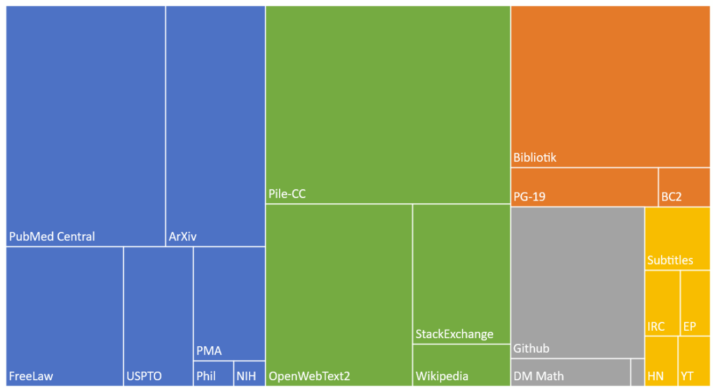

Workshop Overview
---
<!-- column_layout: [2, 4] -->

<!-- column: 0 -->
# Schedule
1. Presentations
- [x] Introduction
- [ ] RAG Systems
- [ ] LLM Agents
<!-- pause -->
<!-- new_line -->
2. Hands-on Research with LLMs
<!-- pause -->
<!-- new_line -->
3. Presentations and Coronation (tomorrow)

<!-- column: 1 -->
<!-- pause -->

## Organisational Notes
- **Code of Conduct:** "Be excellent to each other" 
- Coffee can be found outside the workshop room to the left
- Feel free to reach out to the organizers if you need help
- Presenters will be available to answer questions during the workshop
- The workshop concludes **online** at **10am** tomorrow
<!-- pause -->

> [!caution]
> Photos and videos will be taken during the workshop. Please contact the organizers if you do not want to be included. Otherwise, your participation will be considered as consent to be photographed and filmed. The pictures will be shared among the participants and the organizers. They further might be used for CCLS social media posts and other purposes.

<!-- pause -->
<!-- reset_layout -->
---

<!-- column_layout: [1,1,1,1,1] -->
<!-- column: 0 -->
| Team A |
| ------ |
| Carl |
| Bob |
| Anna   |
| Dirk  |
<!-- column: 1 -->
| Team B |
| ------ |
| Carl |
| Bob |
| Anna   |
| Dirk  |
<!-- column: 2 -->
| Team B |
| ------ |
| Carl |
| Bob |
| Anna   |
| Dirk  |
<!-- column: 3 -->
| Team B |
| ------ |
| Carl |
| Bob |
| Anna   |
| Dirk  |
<!-- column: 4 -->
| Team B |
| ------ |
| Carl |
| Bob |
| Anna   |
| Dirk  |
<!-- reset_layout -->
> Go sit with your teammates!
<!-- end_slide -->

LLM Basics
---

# L(arge) L(anguage) M(odel)s
- Machine Learning Models in the context of Natural Language Processing
- Trained on a large corpus of text data in a self-supervised way
- Generative Pretrained Transformers (GPT) are the largest
- Can be fine-tuned for specific tasks
- Can be guided by prompt engineering
> Kickstarted in 2017 by the "Attention Is All You Need" paper by Google

<!--pause-->
## What can they do?
- Predict words...
<!--pause-->
- .. But *many* tasks can be formulated as word predictions!
<!-- pause -->
- Customer Support, Content Creation, Education and Tutoring, Translation and Localization, ...
<!-- pause -->

### What can they not do?
- They are trained on the Internet and the Internet is full of bad data!
- Issues around Diversity/Racism/Stereotyping/Toxicity and many more
- Hallucinations: "Today six years ago Aachen was selected as the capital city of Germany." - Copilot/LLama3
> ChatGPT is like an "omniscient, eager-to-please intern who sometimes lies to you"

<!-- end_slide -->
The Pile
---



> "The Pile" a 825 GB dataset of textfrom the web, collected by OpenAI in 2021.
It contains a mix of text and audio data. (https://arxiv.org/pdf/2101.00027)

<!-- end_slide -->

LLM Basics
---

# How do they work?

- Based on the **Transformer architecture**
- Uses attention mechanisms to focus on relevant parts of the input
- Trained via **self-supervised learning**
- Learn **statistical patterns**, not actual understanding
- They don’t "know" facts — they mimic language patterns

<!-- pause -->

## What are tokens?
- **Tokenization** is used to process input
- "ChatGPT is great!" → ['Chat', 'G', 'PT', 'is', 'great', '!']
- Generate text **one token at a time**
- "The cat sat on the ___." → 'mat', 'sofa', 'roof' — based on probabilities

<!-- pause -->
### What is Prompt Engineering?

- Crafting inputs (prompts) to guide LLMs toward desired outputs  
- The model’s “instructions” for generating text
- Small changes in wording can drastically affect results  
- E.g., "Write a summary" vs. "Summarize in two sentences"
- Techniques include:  
  - Few-shot prompting (providing examples)  
  - Zero-shot prompting (direct instructions)  
  - Chain-of-thought prompting (step-by-step reasoning)
- Prompt engineering helps reduce errors and hallucinations  
> It’s part art, part science!


<!-- end_slide -->

LLM Basics
---

# Fine-tuning and Customization

- Pretrained LLMs can be **fine-tuned** on specific datasets  
- Tailors the model to specialized tasks or domains
- Enables improved accuracy for niche applications  
- E.g., medical advice, legal documents, customer support scripts
- Fine-tuning adjusts model weights without retraining from scratch  
- Saves time and resources
- Custom models help address biases and reduce hallucinations for critical tasks

<!-- pause -->

## Retrieval-Augmented Generation

- **RAG** combines LLMs with external knowledge sources  
- Retrieves relevant documents to improve answer accuracy
- Helps reduce hallucinations by grounding responses in real data  
- Useful for up-to-date info or specialized knowledge
<!-- pause -->

### Agents

- **Agents** are LLM-powered systems that can perform multiple tasks  
- E.g., web browsing, data querying, executing code
- Agents can interact with tools and APIs dynamically  
- Making LLMs more practical and interactive

> Together, RAG and Agents push LLMs beyond text generation. Towards intelligent assistants and complex workflows

<!-- end_slide -->
Setting up your environment
---
> You need Python>=3.8 and pip. Run **pip install openai** and ensure you have a working internet connection.

```python +line_numbers +exec
import os
from openai import AzureOpenAI

client = AzureOpenAI(azure_endpoint="https://workshopccls.openai.azure.com/", api_key="REPLACE_WITH_WORKSHOP_KEY", api_version="2025-01-01-preview")

completion = client.chat.completions.create(model="gpt-4.1-nano", messages=[
    {"role": "system", "content": "You are a helpful assistant."},
    {"role": "user", "content": "Tell me a joke about LLMs!"}
  ])

print(completion.choices[0].message.content)    
```

<!-- end_slide -->
Tips And Tricks
---

# Why Token Management Matters
- GPT models have a **maximum token limit** per request.
- GPT-4.1-nano supports up to **1M tokens**, but each model has its own cap.
- Tokens ≠ words** "ChatGPT is awesome!" ≈ 5 tokens.

## Rolling Chat History

```text
[ System Prompt ]
[ User: Q1 ] → [ Assistant: A1 ]
[ User: Q2 ] → [ Assistant: A2 ]
...
```

- **Retain context** for ongoing conversations  
- **Too many turns?** Start dropping earliest ones.

```python
def trim_history(messages, max_tokens=3000):
    # Remove oldest pairs until within token limit
    while num_tokens_from_messages(messages) > max_tokens:
        messages.pop(1)  # remove user
        messages.pop(1)  # remove assistant
    return messages
```
<!-- end_slide -->
Tips And Tricks
---

# Tokens contd.
- **Summarize** earlier messages dynamically.
- Use concise system prompts.
- Count tokens using `tiktoken`:

```python
import tiktoken
def count_tokens(text, model="gpt-4.1-nano"):
    enc = tiktoken.encoding_for_model(model)
    return len(enc.encode(text))
```

## Model Parameter Tuning

| Parameter           | Purpose                                               | Recommended Range             |
|---------------------|-------------------------------------------------------|-------------------------------|
| `temperature`        | Controls randomness and creativity                    | `0.0` (deterministic) – `1.0` (creative) |
| `top_p`             | Limits diversity via nucleus sampling (probability mass) | `0.7` – `1.0`              |
| `max_tokens`        | Caps the number of tokens in the **response only**     | Depends on model (e.g., `1` – `4096+`) |
| `presence_penalty`  | Encourages discussion of new topics                    | `-2.0` (repeat) – `2.0` (novel) |
| `frequency_penalty` | Reduces repetition of frequent tokens                  | `-2.0` (more) – `2.0` (less)   |
| `logit_bias`        | Adjusts likelihood of specific tokens (via token ID)   | Dict, e.g., `{"50256": -100}`  |

- Use **either** `temperature` or `top_p`, not both unless you're experimenting.
- `presence_penalty` = encourage **new concepts**; `frequency_penalty` = reduce **repetition**.
- `logit_bias` is powerful for **token-level control** (e.g., force answers, avoid words).
- Combine parameters to fine-tune tone, creativity, and response struct

<!-- end_slide -->


<!-- jump_to_middle -->

The end
---

