# Synthetic Data in Healthcare
*SOTA, Tools and Methods*

(Last Update: 20.11.2024)

---

>This slidedeck is mostly based on the publication "Synthetic data generation methods in healthcare: A review of open-source tools and methods" by C. Pezoulas et al., published December 2024 in the Computational and Structural Biotechnology Journal.

---

### What is synthetic data?

EHR, wearable devices, genomic sequencing, imaging, telemedicine, ... vast amount of data is generated.

As it is sensitive data, there are significant obstacles in using them though!

Synthetic data **mimics** real-world data without the privacy issues.

---

### Additional benefits of Synthetic Data

- Data can be skewed or underrepresented ...
- ... with harmful bias (age, race, gender, ...)
- Synthetic Data can mitigate these biases

---

### What is Synthetic Data Generation?
- AI requires unbiased, large amounts of training data
- This data is often hard to get, especially in healthcare
- **Data Scarcity:** few data is available for rare conditions
- **Privacy Concerns:** data can often not easily be shared

---

### Goal of this paper:

Explore synthetic data generation techniques in healthcare

---

# Content

1. Synthetic Data Generation Studies
2. Overview of Methods used
3. Data Types, Scope, Algorithms and Metrics
4. Advantages and Weaknesses

---

1. Synthetic Data Generation Studies

<!--v-->

### Systematic Literature Review

- PubMed and Scopus were searched
- Tabular, Imaging, Radiomics, Timeseries, and Omics data
- Publications from 2015-2024 considered

<!--v-->

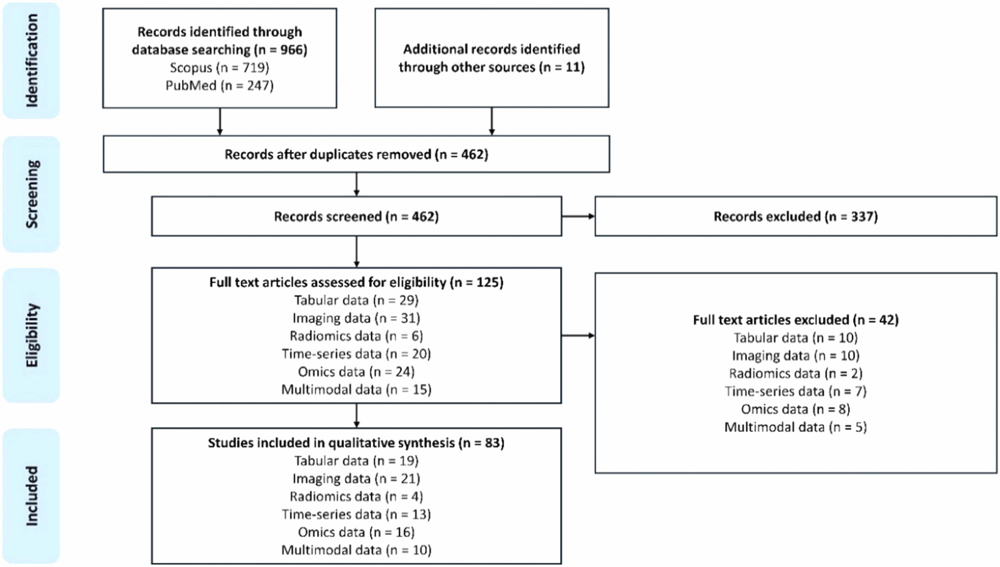

---

2. Overview of Methods used

<!--v-->

### Sythetic Data Generation Workflow

1. Data Acquisition
2. Data Preparation
3. Data Modeling
4. Data Quality Evaluation

<!--v-->

### Trends in the Field

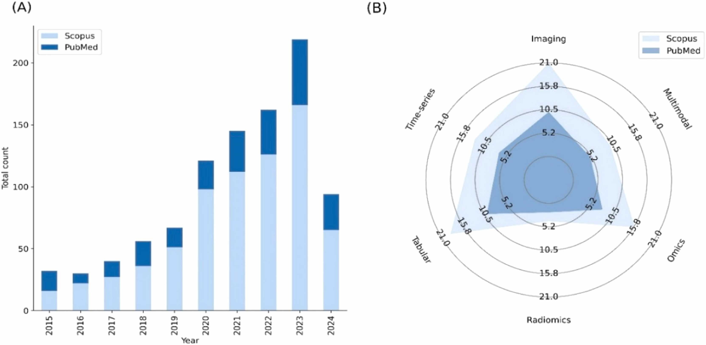

<!--v-->

### Methods and Languages

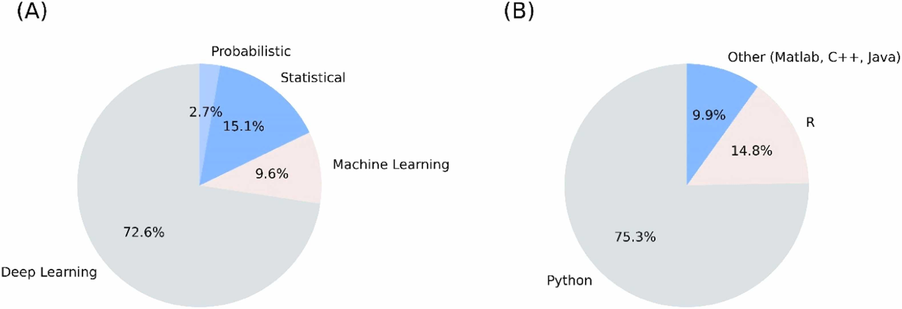

---

3. Data Types, Scope, Algorithms and Metrics

<!--v-->

### SOTA per Datatype

<!--v-->
<!-- .slide: data-auto-animate -->
### Tabular Data <!-- .element: data-id="code-animation"-->
- Deep Demographics / laboratory examinations / therapies / lifestyle data
- Statistical/probability based 
    - Examples: Bootstrapping, Multivariate Normal Distribution (MVND), Bayesion Models,...
    - Uses: covariate simulation, generation of large scale high-fidelity patient data, disease progression modeling, data augmentation for classification and risk stratification, simulation of augmented clinical trials
<!--v-->
<!-- .slide: data-auto-animate -->
### Tabular Data <!-- .element: data-id="code-animation"-->
- ML-based
    - Examples: Tree ensembles, radial basis function based NNs, state-transition, machines, Bayesian Inference, ...
    - Uses: Augmentation for disease progression, digital twin generation, large scale population generation
<!--v-->
<!-- .slide: data-auto-animate -->
### Tabular Data <!-- .element: data-id="code-animation"-->
- DL-based
    - Examples: various variations of GANs, Tabular Variational Autoencoder (TVAE), VAE, ...
    - Uses: Privacy-conscious synthetic data generation for CDS, synthetic population and digital twin generation, improving predictions on minority groups
<!--v-->
<!-- .slide: data-auto-animate -->
### Tabular Data <!-- .element: data-id="code-animation"-->
- Metrics used:
    - Measure how well the statistics are preserved
    - example: descriptive statistics, relative bias, Spearmen / Pearson correlation,
    - Privacy Metrics: ensure individual privacy: K-anonymitp, K-map, L-diversity, ε-identifiability,

<!--v-->

### Imaging Data

- GANs play a critical role, with few other algorithms in this area
- Metrics: 
    - Frechet Inception Distance (FID), Inception Score (IS)
    - Compare feature distribution and evaluate classifier performance
    - Structural Similarity Index, peak signal to noise ratio, visual information fidelity, ...

<!--v-->

### Radiomics Data

- Critical subfield of medical imaging
- Again, mostly GAN based DL approaches
- Metrics: t-SNE, Correlation Coefficiant (CC), Chi-Square to test distributions of categorical variables

<!--v-->

<!-- .slide: data-auto-animate -->
### Timeseries data<!-- .element: data-id="code-animation"-->
- Data such as ECG, sensor-based measures, longitudinal observation or biosignals
- Notable Statistical-based methods: Guided Evolutionary Synthesizer (GES), Statistical Feature Space Selection, Sythotic Acute Syndromes Creator
<!--v-->
<!-- .slide: data-auto-animate -->
### Timeseries data<!-- .element: data-id="code-animation"-->
- ML/DL based approaches also used a lot
    - Hidden Markov Models (HMM), Regression learners, GANs, DoppelGANger (MLP), TS-GAN, HealthGAN, VAE, ...
<!--v-->
<!-- .slide: data-auto-animate -->
### Timeseries data<!-- .element: data-id="code-animation"-->
- Uses: Adversial learning on biosignal data, generating synthetic data considering metadata, augmenting sensor data, synthesizing timeseries EHR data, imbalance of uncommon diseases, multivariate time series generation, generating ECG data
<!--v-->
<!-- .slide: data-auto-animate -->
### Timeseries data<!-- .element: data-id="code-animation"-->
- Metrics: MAE, Autocorrelation, Maximum MEan Discrepancy, MSE, bias scores, t-SNE and PCA inspection, Dynamic Time Warping (DTW), ... performance-based metrics for Classification and prediction

<!--v-->
<!-- .slide: data-auto-animate -->
### Omics Data<!-- .element: data-id="code-animation"-->
- Heavily reliant of established statistical principles
- enriched pathways, causal feature clusters, Cascade methods, probabilistic modeling, power lag degree distribution, time-evolving graphs
<!--v-->
<!-- .slide: data-auto-animate -->
### Omics Data<!-- .element: data-id="code-animation"-->
- Uses: semi-synthetic metabolomics data, validate stratified causal discovery, simulate gene expression, model real data distributions, generate network topologies for tumor cells, mimic improve proteomics data, overcame multi-omics data integration challenges, human microbiome dynamic studies, synthetic transcriptomics data generation
- DL has also been used (GANs, some VAE and DBM), but to a lesser extend
<!--v-->
<!-- .slide: data-auto-animate -->
### Omics Data<!-- .element: data-id="code-animation"-->
- Metrics: Recall, Precision, AUC, overlap coefficient, clustering similarity, feature significance, 

<!--v-->

### Multimodel Data

- Most work on specific DL methods: GANs, LSTM encoder-decoder
- Uses: Synthetic patient level data integrating statistic and timeseries elements, multimodel 3D image generation with text and tabular data, missing MRI modality generation, pseudo-medical images, synthetic X-ray images, synthetic EHRs
- Metrics: include mostly all of the metrics from the individual data types

---

4. Advantages and Weaknesses

- Synthetic data can contribute to trustworthy AI
- Private, fair, robust
- Mitigate data breach risks
- Correct biasis => promote fairness, reduce discrimination
- Reduce vulnerabilities to adversarial attacks

<!--v-->

<!-- .slide: data-auto-animate -->
### Conclusion<!-- .element: data-id="code-animation"-->

<!--v-->
<!-- .slide: data-auto-animate -->
### Conclusion<!-- .element: data-id="code-animation"-->
- Crucial for the development of robust and accurate models
- Tabular data generation is often statistical and probabilistic
- ML medols help in the generation of large-scale virtual populations for in silico trials
- DL based methods are used for privacy-conscious data generation

<!--v-->
<!-- .slide: data-auto-animate -->
### Conclusion<!-- .element: data-id="code-animation"-->
- GANs are crucial in imaging
- Timeseries data is also dominated by various GAN models
- Omics have a strong statistical-based foundation, with DL catching up
- Multimodal data also heavily relies on GANs
- The variety of methods highlights significant advancements, tailored to diverse needs

<!--v-->
<!-- .slide: data-auto-animate -->
### Conclusion<!-- .element: data-id="code-animation"-->
- Challenges related to quality, representativeness and ethical use persist
- Data fidelity, biases introduced in the generated data and the need for AI training data remain challenges
- Future work will focus on accuracy, reliability and ethical aspects, ensuring applicability in real-world settings

<!--v-->
<!-- .slide: data-auto-animate -->
### Conclusion<!-- .element: data-id="code-animation"-->
- The fidelity of synthetic data should be a focus, to ensure a good mimicing of real-world data
- Addressing biases in synthetic data generation is another critical factor
- Emphasis should be given to the refinement of ethical guidelines and regulatory frameworks for the use of synthetic data in healthcare

---

<!-- .slide: data-auto-animate -->
### My thoughts<!-- .element: data-id="code-animation"-->

- Solid overview of all the synthetic data generation methods in various domains
- True value of this work is the overview and analysis of techniques per field
- Synthetic data is highly relevant, but still in need of improvement
    - Data fidelity, bias detection, etc., etc.
<!--v-->
<!-- .slide: data-auto-animate -->
### My thoughts<!-- .element: data-id="code-animation"-->
- Especially with underrepresented populations / rare syndromes working with synthetic data can be crucial
- Generating good synthetic data can allow for more easily accessible data pools, a huge benefit

---

### Deep Dive Into Synthetic Timeseries Data

<!--v-->

> This is mostly motivated by my work on the Diagnostic Expert Advisor (DEA) and the prediction of Acute Respiratory Distress Syndrome (ARDS). Based on the information collected in the paper I looked into some of the techniques deployed and provide a small overview here.

<!--v-->

### Methods not considered

*no source code was available at the time for a few interesting models. Please refer to the paper and see if that changed by now.*

<!--v-->

### SSD-ECG (42 ⭐)

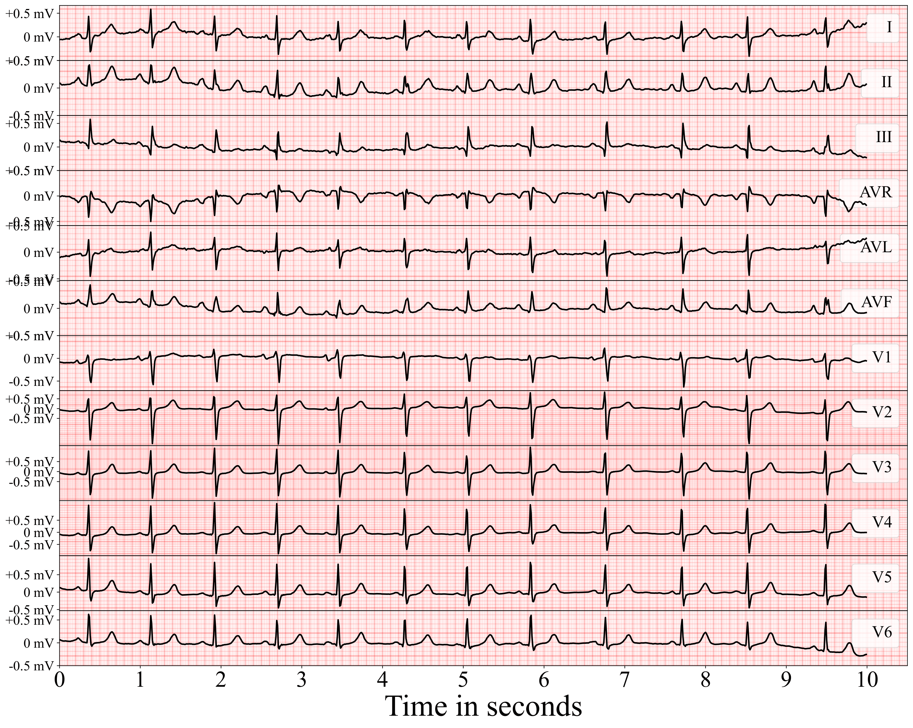

<!--v-->

### CR-VAE (24 ⭐)

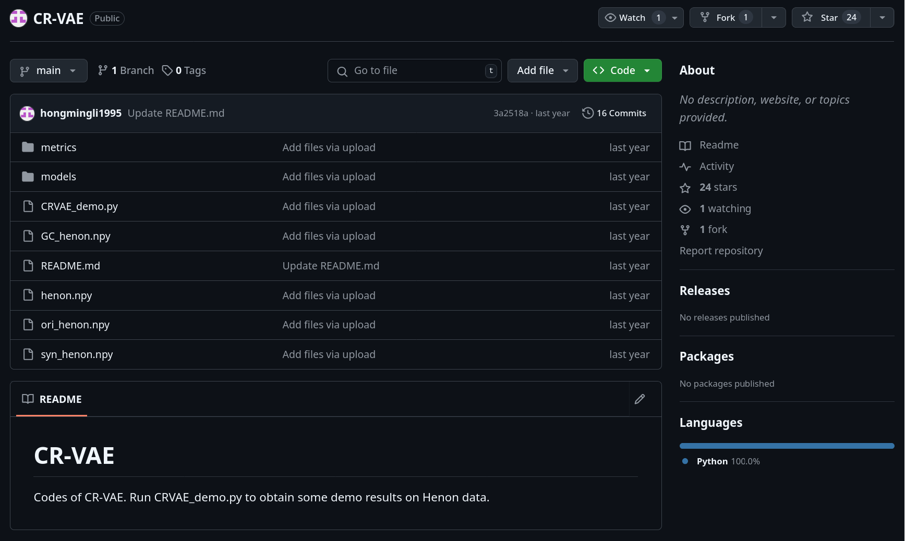

<!--v-->

### SASC (0 ⭐)

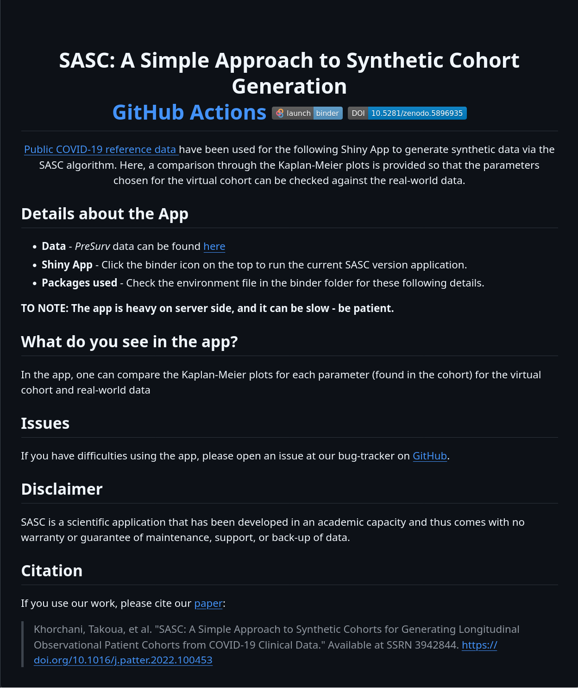

<!--v-->

### MTGAN (30 ⭐)

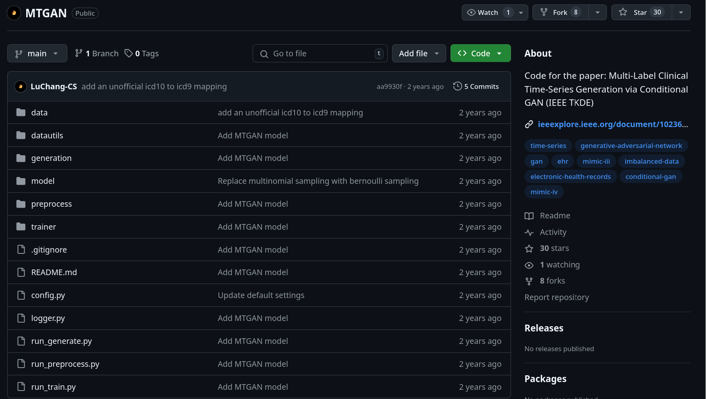

<!--v-->

### COSCI-GAN (31 ⭐)

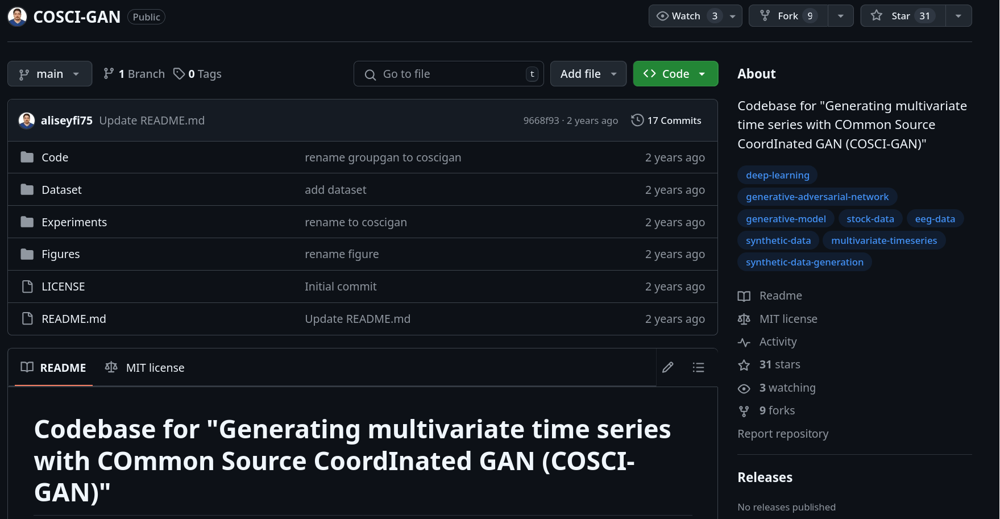

<!--v-->

### timegan (=> Vanderschaar Lab)

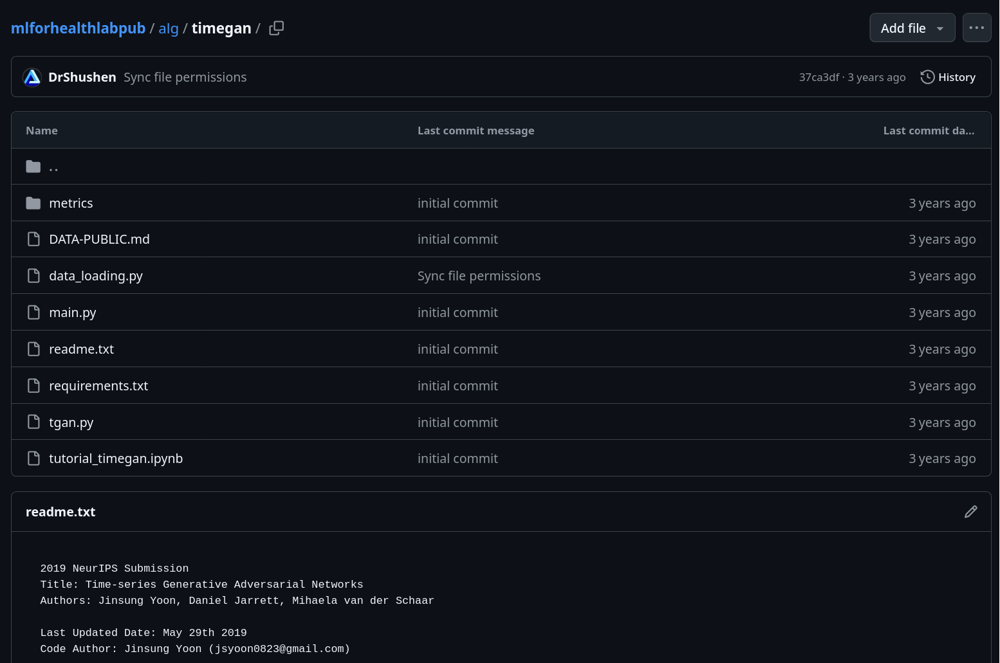

<!--v-->

### Synthcity (457 ⭐)

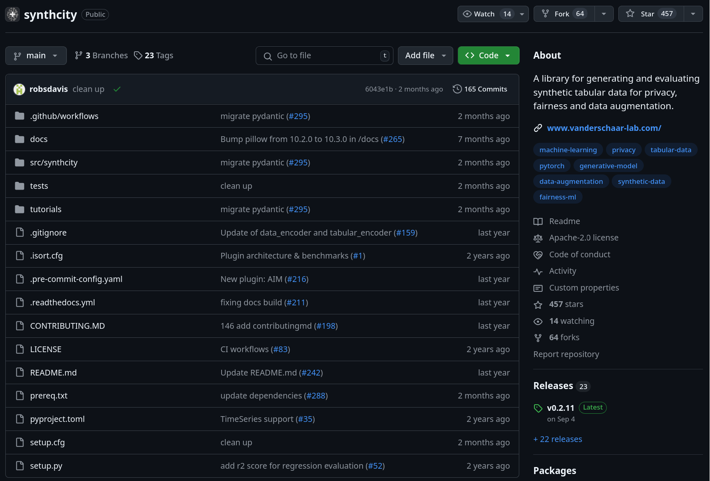

<!--v-->

### Synthcity (457 ⭐)

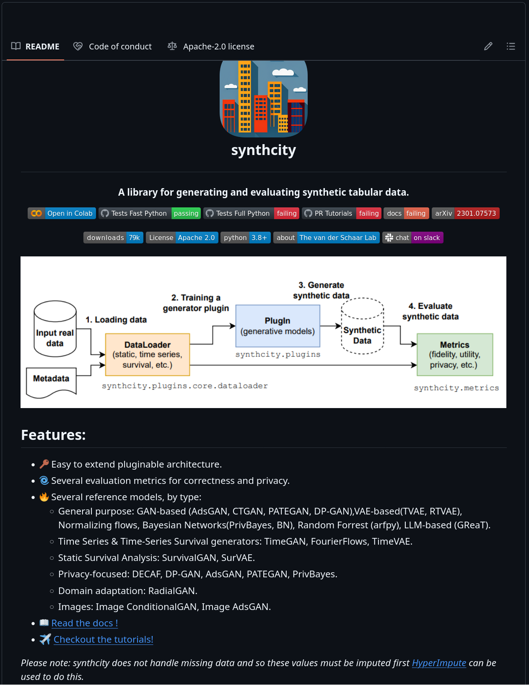

<!--v-->

### TTS-GAN (247 ⭐)

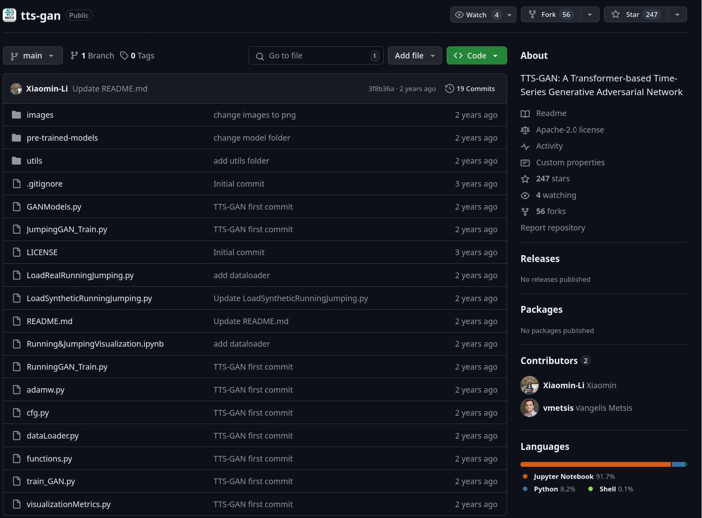

<!--v-->

### biosignalGANs (5 ⭐)

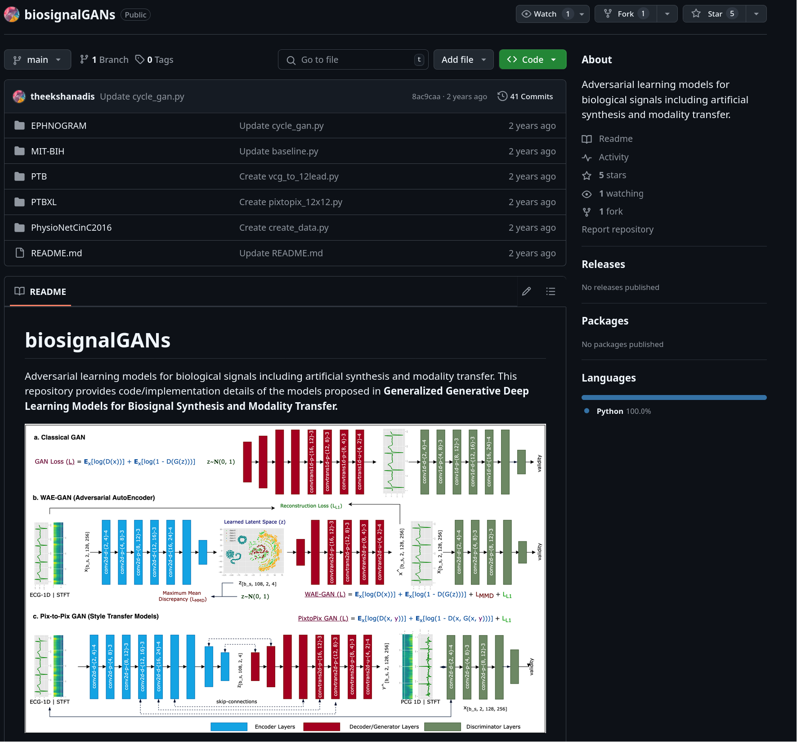

<!--v-->

### SynSys-Update (8 ⭐)

<!--v-->

### DoppelGANger (299 ⭐)

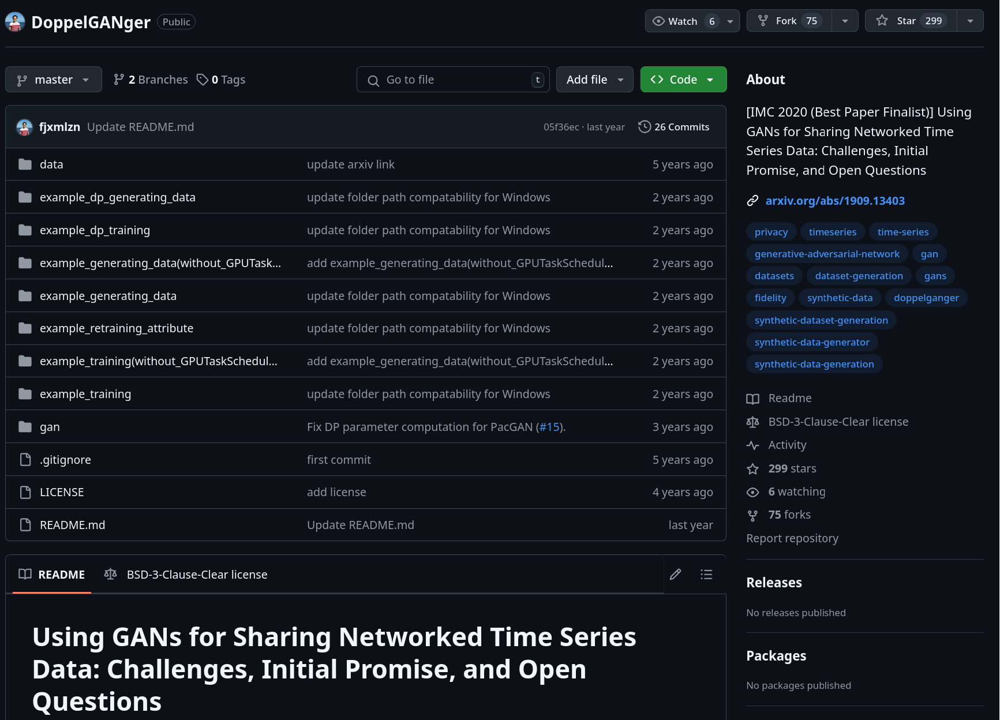

---

### Synthcity Experiment

- Ran locally, as cluster was down
- Fit to single patient data
- Roughly 1 hour computation time

<!--v-->

### Original Horowitz

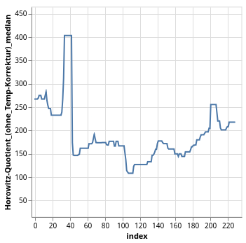

<!--v-->

### Fit of the GAN after one hour

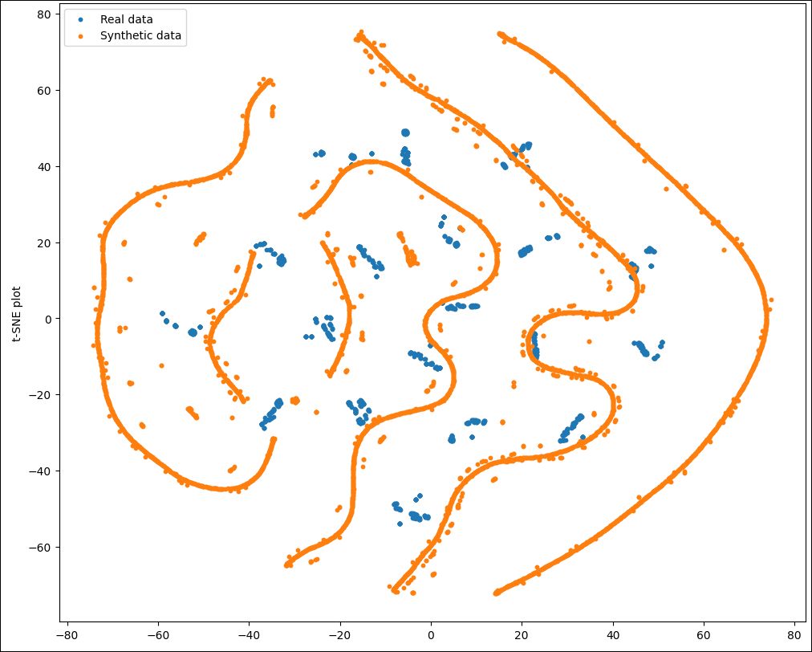

<!--v-->

### Prediction

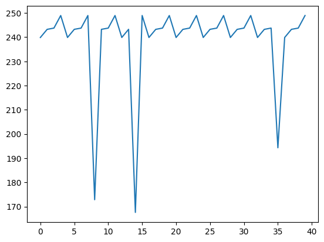